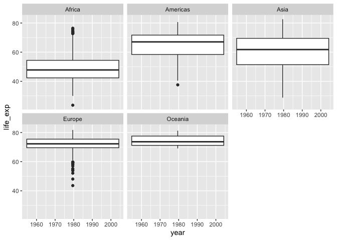

## Instructions
Answer the following questions and complete the exercises in RMarkdown. Please embed all of your code and push your final work to your repository. Your final lab report should be organized, clean, and run free from errors. Remember, you must remove the `#` for the included code chunks to run. Be sure to add your name to the author header above. For any included plots, make sure they are clearly labeled. You are free to use any plot type that you feel best communicates the results of your analysis.  

**In this homework, you should make use of the aesthetics you have learned. It's OK to be flashy!**

Make sure to use the formatting conventions of RMarkdown to make your report neat and clean!  

## Load the libraries

```r
library(tidyverse)
library(janitor)
library(here)
library(naniar)
```


```r
options(scipen = 999)
```

## Resources
The idea for this assignment came from [Rebecca Barter's](http://www.rebeccabarter.com/blog/2017-11-17-ggplot2_tutorial/) ggplot tutorial so if you get stuck this is a good place to have a look.  

## Gapminder
For this assignment, we are going to use the dataset [gapminder](https://cran.r-project.org/web/packages/gapminder/index.html). Gapminder includes information about economics, population, and life expectancy from countries all over the world. You will need to install it before use. This is the same data that we will use for midterm 2 so this is good practice.

```r
#install.packages("gapminder")
library("gapminder")
```

## Questions
The questions below are open-ended and have many possible solutions. Your approach should, where appropriate, include numerical summaries and visuals. Be creative; assume you are building an analysis that you would ultimately present to an audience of stakeholders. Feel free to try out different `geoms` if they more clearly present your results.  

**1. Use the function(s) of your choice to get an idea of the overall structure of the data frame, including its dimensions, column names, variable classes, etc. As part of this, determine how NAs are treated in the data.**  

```r
gapminder <- gapminder %>% clean_names()
```


```r
names(gapminder)
```

```
## [1] "country"    "continent"  "year"       "life_exp"   "pop"       
## [6] "gdp_percap"
```


```r
glimpse(gapminder)
```

```
## Rows: 1,704
## Columns: 6
## $ country    <fct> "Afghanistan", "Afghanistan", "Afghanistan", "Afghanistan",…
## $ continent  <fct> Asia, Asia, Asia, Asia, Asia, Asia, Asia, Asia, Asia, Asia,…
## $ year       <int> 1952, 1957, 1962, 1967, 1972, 1977, 1982, 1987, 1992, 1997,…
## $ life_exp   <dbl> 28.801, 30.332, 31.997, 34.020, 36.088, 38.438, 39.854, 40.…
## $ pop        <int> 8425333, 9240934, 10267083, 11537966, 13079460, 14880372, 1…
## $ gdp_percap <dbl> 779.4453, 820.8530, 853.1007, 836.1971, 739.9811, 786.1134,…
```

**2. Among the interesting variables in gapminder is life expectancy. How has global life expectancy changed between 1952 and 2007?**

```r
gapminder %>% 
  select(continent, year, life_exp) %>% 
  filter(between(year, 1952, 2007)) %>% 
  arrange(year)
```

```
## # A tibble: 1,704 × 3
##    continent  year life_exp
##    <fct>     <int>    <dbl>
##  1 Asia       1952     28.8
##  2 Europe     1952     55.2
##  3 Africa     1952     43.1
##  4 Africa     1952     30.0
##  5 Americas   1952     62.5
##  6 Oceania    1952     69.1
##  7 Europe     1952     66.8
##  8 Asia       1952     50.9
##  9 Asia       1952     37.5
## 10 Europe     1952     68  
## # ℹ 1,694 more rows
```

**3. How do the distributions of life expectancy compare for the years 1952 and 2007?**

```r
gapminder %>% 
  select(year, life_exp, continent) %>% 
  filter(between(year, 1952, 2007)) %>% 
  mutate(year=as.factor(year)) %>% 
  ggplot(aes(x=year, y=life_exp))+
  geom_col()+
  labs(title = "Global Life Expectancy Between 1952 - 2007",
       x="Year",
       y="Life Expectancy")+
  theme_minimal()+
  theme(legend.position = "left") #the life expectancy has increased over the years
```

<!-- -->

**4. Your answer above doesn't tell the whole story since life expectancy varies by region. Make a summary that shows the min, mean, and max life expectancy by continent for all years represented in the data.**

```r
gapminder %>% 
  group_by(continent, year) %>% 
  summarise(min_life_exp=min(life_exp),
            mean_life_exp=mean(life_exp),
            max_life_exp=max(life_exp), .groups = "keep") 
```

```
## # A tibble: 60 × 5
## # Groups:   continent, year [60]
##    continent  year min_life_exp mean_life_exp max_life_exp
##    <fct>     <int>        <dbl>         <dbl>        <dbl>
##  1 Africa     1952         30            39.1         52.7
##  2 Africa     1957         31.6          41.3         58.1
##  3 Africa     1962         32.8          43.3         60.2
##  4 Africa     1967         34.1          45.3         61.6
##  5 Africa     1972         35.4          47.5         64.3
##  6 Africa     1977         36.8          49.6         67.1
##  7 Africa     1982         38.4          51.6         69.9
##  8 Africa     1987         39.9          53.3         71.9
##  9 Africa     1992         23.6          53.6         73.6
## 10 Africa     1997         36.1          53.6         74.8
## # ℹ 50 more rows
```

**5. How has life expectancy changed between 1952-2007 for each continent?**

```r
gapminder %>% 
  filter(between(year, 1952, 2007)) %>% 
  mutate(year=as.factor(year)) %>% 
  ggplot(aes(x=year, y=life_exp, fill=continent))+
  geom_col()+
  labs(title = "Global Life Expectancy Between 1952 - 2007",
       x="Year",
       y="Life Expectancy")+
  theme_minimal()+
  theme(legend.position = "left") #this is the distribution of life expectancy by continent
```

<!-- -->

**6. We are interested in the relationship between per capita GDP and life expectancy; i.e. does having more money help you live longer?**

```r
gapminder %>% 
  ggplot(aes(x=gdp_percap, y=life_exp))+
  geom_point(size=0.25, color="darkseagreen4")+
  labs(title = "Per Capita GDP vs. Life Expectancy",
       x="Per Capita GDP",
       y="Life Expectancy")+
  theme_minimal()+
  theme(legend.position = "left")+
  theme(plot.title = element_text(size=rel(1.0), hjust=0.5)) #Having more money doesnt seem to increase life expectancy 
```

<!-- -->

**7. Which countries have had the largest population growth since 1952?**

```r
gapminder %>% 
  group_by(country) %>% 
  summarise(min_pop=min(pop),
            max_pop=max(pop)) %>% 
  arrange(-max_pop)
```

```
## # A tibble: 142 × 3
##    country         min_pop    max_pop
##    <fct>             <int>      <int>
##  1 China         556263527 1318683096
##  2 India         372000000 1110396331
##  3 United States 157553000  301139947
##  4 Indonesia      82052000  223547000
##  5 Brazil         56602560  190010647
##  6 Pakistan       41346560  169270617
##  7 Bangladesh     46886859  150448339
##  8 Nigeria        33119096  135031164
##  9 Japan          86459025  127467972
## 10 Mexico         30144317  108700891
## # ℹ 132 more rows
```

**8. Use your results from the question above to plot population growth for the top five countries since 1952.**

```r
gapminder %>% 
  group_by(country) %>% 
  summarise(min_pop=min(pop),
            max_pop=max(pop)) %>% 
  arrange(-max_pop) %>% 
  top_n(5, max_pop) %>% 
  ggplot(aes(x=country, y=max_pop, fill=country))+
  geom_col()+
  labs(title = "Top Five Country Populations",
       x="Country",
       y="Population")+
  theme_minimal()+
  theme(legend.position = "left")+
  theme(plot.title = element_text(size=rel(1.0), hjust=0.5))
```

<!-- -->

**9. How does per capita GDP growth compare between these same five countries?**

```r
gapminder %>% 
  group_by(country) %>% 
  summarise(min_gdp=min(gdp_percap),
            max_gdp=max(gdp_percap)) %>% 
  arrange(-max_gdp) %>% 
  top_n(5, max_gdp) %>% 
  ggplot(aes(x=country, y=max_gdp, fill=country))+
  geom_col()+
  labs(title = "Top Five Country GDP",
       x="Country",
       y="GDP %")+
  theme_minimal()+
  theme(legend.position = "left")+
  theme(plot.title = element_text(size=rel(1.0), hjust=0.5))
```

<!-- -->

**10. Make one plot of your choice that uses faceting!**

```r
gapminder %>% 
  ggplot(aes(x=year, y=life_exp))+
  geom_boxplot(na.rm = T)+
  facet_wrap(~continent)
```

```
## Warning: Continuous x aesthetic
## ℹ did you forget `aes(group = ...)`?
```

<!-- -->

## Push your final code to GitHub!
Please be sure that you check the `keep md` file in the knit preferences. 
