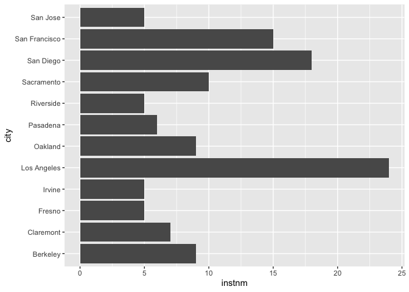
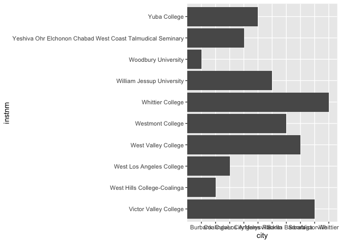
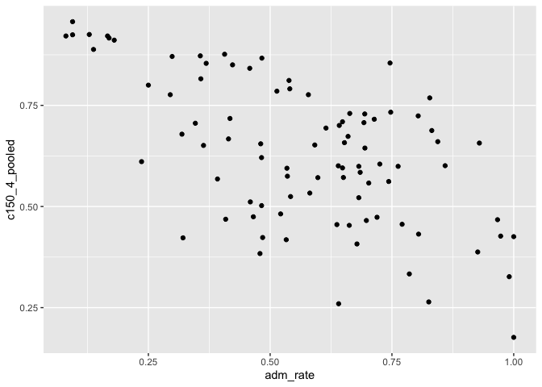
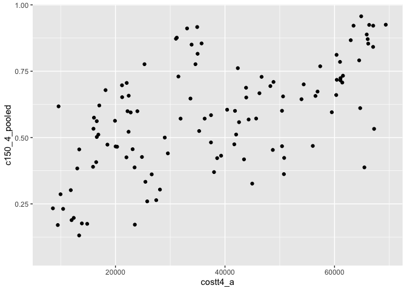
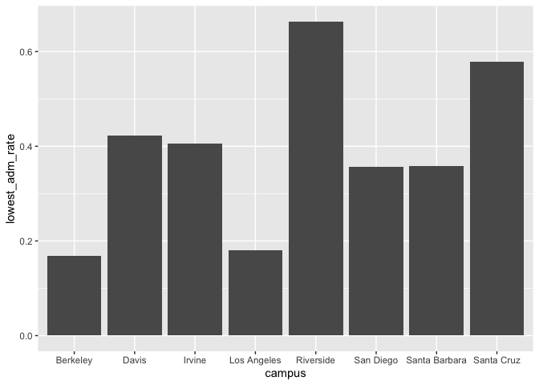
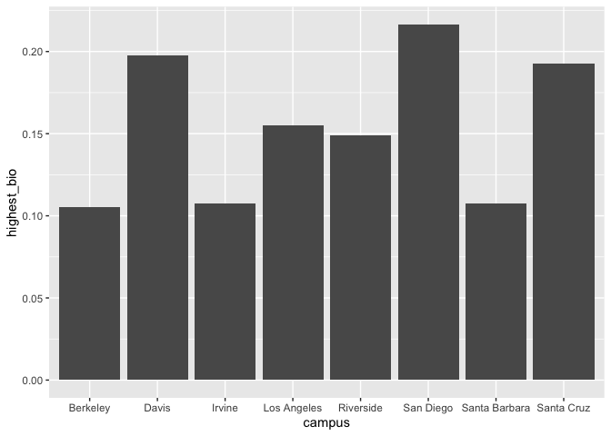

## Instructions
Answer the following questions and complete the exercises in RMarkdown. Please embed all of your code and push your final work to your repository. Your final lab report should be organized, clean, and run free from errors. Remember, you must remove the `#` for the included code chunks to run. Be sure to add your name to the author header above.  

Make sure to use the formatting conventions of RMarkdown to make your report neat and clean!  

## Load the libraries

```r
library(tidyverse)
library(janitor)
library(here)
library(naniar)
```


```r
getwd()
```

```
## [1] "/Users/lejla.becirevic/Desktop/BIS15W2024_lbecirevic/homework"
```

For this homework, we will take a departure from biological data and use data about California colleges. These data are a subset of the national college scorecard (https://collegescorecard.ed.gov/data/). Load the `ca_college_data.csv` as a new object called `colleges`.

```r
colleges <- read_csv("data/ca_college_data.csv") %>% clean_names()
```

```
## Rows: 341 Columns: 10
## ── Column specification ────────────────────────────────────────────────────────
## Delimiter: ","
## chr (4): INSTNM, CITY, STABBR, ZIP
## dbl (6): ADM_RATE, SAT_AVG, PCIP26, COSTT4_A, C150_4_POOLED, PFTFTUG1_EF
## 
## ℹ Use `spec()` to retrieve the full column specification for this data.
## ℹ Specify the column types or set `show_col_types = FALSE` to quiet this message.
```

The variables are a bit hard to decipher, here is a key:  

INSTNM: Institution name  
CITY: California city  
STABBR: Location state  
ZIP: Zip code  
ADM_RATE: Admission rate  
SAT_AVG: SAT average score  
PCIP26: Percentage of degrees awarded in Biological And Biomedical Sciences  
COSTT4_A: Annual cost of attendance  
C150_4_POOLED: 4-year completion rate  
PFTFTUG1_EF: Percentage of undergraduate students who are first-time, full-time degree/certificate-seeking undergraduate students  

1. Use your preferred function(s) to have a look at the data and get an idea of its structure. Make sure you summarize NA's and determine whether or not the data are tidy. You may also consider dealing with any naming issues.

```r
glimpse(colleges)
```

```
## Rows: 341
## Columns: 10
## $ instnm        <chr> "Grossmont College", "College of the Sequoias", "College…
## $ city          <chr> "El Cajon", "Visalia", "San Mateo", "Ventura", "Oxnard",…
## $ stabbr        <chr> "CA", "CA", "CA", "CA", "CA", "CA", "CA", "CA", "CA", "C…
## $ zip           <chr> "92020-1799", "93277-2214", "94402-3784", "93003-3872", …
## $ adm_rate      <dbl> NA, NA, NA, NA, NA, NA, NA, NA, NA, NA, NA, NA, NA, NA, …
## $ sat_avg       <dbl> NA, NA, NA, NA, NA, NA, NA, NA, NA, NA, NA, NA, NA, NA, …
## $ pcip26        <dbl> 0.0016, 0.0066, 0.0038, 0.0035, 0.0085, 0.0151, 0.0000, …
## $ costt4_a      <dbl> 7956, 8109, 8278, 8407, 8516, 8577, 8580, 9181, 9281, 93…
## $ c150_4_pooled <dbl> NA, NA, NA, NA, NA, NA, 0.2334, NA, NA, NA, NA, 0.1704, …
## $ pftftug1_ef   <dbl> 0.3546, 0.5413, 0.3567, 0.3824, 0.2753, 0.4286, 0.2307, …
```

2. Which cities in California have the highest number of colleges?

```r
colleges %>% 
  group_by(city) %>% 
  summarise(instnm=n_distinct(instnm)) %>% 
  arrange(-instnm) #Los Angeles has the highest number of colleges
```

```
## # A tibble: 161 × 2
##    city          instnm
##    <chr>          <int>
##  1 Los Angeles       24
##  2 San Diego         18
##  3 San Francisco     15
##  4 Sacramento        10
##  5 Berkeley           9
##  6 Oakland            9
##  7 Claremont          7
##  8 Pasadena           6
##  9 Fresno             5
## 10 Irvine             5
## # ℹ 151 more rows
```

3. Based on your answer to #2, make a plot that shows the number of colleges in the top 10 cities.

```r
colleges %>% 
  group_by(city) %>% 
  summarise(instnm=n_distinct(instnm)) %>% 
  top_n(10, instnm) %>% 
  ggplot(aes(x=city, y=instnm))+
  geom_col()+
  coord_flip() #The plot shows 12 because there is multiple cities with the same number of colleges
```

<!-- -->

4. The column `COSTT4_A` is the annual cost of each institution. Which city has the highest average cost? Where is it located?

```r
colleges %>% 
  filter(costt4_a!="NA") %>% 
  group_by(city, instnm) %>%
  summarise(avg_cost=mean(costt4_a), .groups= 'keep') %>% 
  arrange(-avg_cost)
```

```
## # A tibble: 217 × 3
## # Groups:   city, instnm [217]
##    city          instnm                                        avg_cost
##    <chr>         <chr>                                            <dbl>
##  1 Claremont     Harvey Mudd College                              69355
##  2 Los Angeles   Southern California Institute of Architecture    67225
##  3 Los Angeles   University of Southern California                67064
##  4 Los Angeles   Occidental College                               67046
##  5 Claremont     Claremont McKenna College                        66325
##  6 Malibu        Pepperdine University                            66152
##  7 Claremont     Scripps College                                  66060
##  8 Claremont     Pitzer College                                   65880
##  9 San Francisco San Francisco Art Institute                      65453
## 10 Claremont     Pomona College                                   64870
## # ℹ 207 more rows
```

```r
 #Harvey Mudd College in Claremont has the highest cost
```

5. Based on your answer to #4, make a plot that compares the cost of the individual colleges in the most expensive city. Bonus! Add UC Davis here to see how it compares :>).

```r
colleges %>% 
  filter(costt4_a!="NA") %>% 
  select(instnm, city, costt4_a) %>%
  top_n(10, instnm) %>% 
  ggplot(aes(x=instnm, y=city))+
  geom_col()+
  coord_flip()
```

<!-- -->

6. The column `ADM_RATE` is the admissions rate by college and `C150_4_POOLED` is the four-year completion rate. Use a scatter plot to show the relationship between these two variables. What do you think this means?

```r
colleges %>% 
  select(adm_rate, c150_4_pooled) %>% 
  filter(adm_rate!="NA" & c150_4_pooled!="NA") %>% 
  ggplot(aes(x=adm_rate, y=c150_4_pooled))+
  geom_point() #The colleges with the highest cost have the lowest admissions and colleges with the lowest cost have the highest admissions
```

<!-- -->

7. Is there a relationship between cost and four-year completion rate? (You don't need to do the stats, just produce a plot). What do you think this means?

```r
colleges %>% 
  ggplot(aes(x=costt4_a, y= c150_4_pooled))+
  geom_point(na.rm = T) #It looks like the higher the cost the more likely it is for students to complete all four years
```

<!-- -->

8. The column titled `INSTNM` is the institution name. We are only interested in the University of California colleges. Make a new data frame that is restricted to UC institutions. You can remove `Hastings College of Law` and `UC San Francisco` as we are only interested in undergraduate institutions.

Remove `Hastings College of Law` and `UC San Francisco` and store the final data frame as a new object `univ_calif_final`.

Use `separate()` to separate institution name into two new columns "UNIV" and "CAMPUS".


```r
univ_calif_final <- colleges %>% 
  separate(instnm, into= c("univ", "campus"), sep = "-") %>% 
  filter(univ=="University of California" & !campus %in% c("Hastings College of Law", "San Francisco"))
```

```
## Warning: Expected 2 pieces. Additional pieces discarded in 9 rows [140, 145, 165, 173,
## 177, 292, 298, 299, 300].
```

```
## Warning: Expected 2 pieces. Missing pieces filled with `NA` in 264 rows [1, 2, 3, 4, 5,
## 6, 7, 8, 9, 10, 11, 12, 13, 14, 15, 16, 17, 18, 19, 20, ...].
```

```r
univ_calif_final #I can't get rid of the warning
```

```
## # A tibble: 8 × 11
##   univ  campus city  stabbr zip   adm_rate sat_avg pcip26 costt4_a c150_4_pooled
##   <chr> <chr>  <chr> <chr>  <chr>    <dbl>   <dbl>  <dbl>    <dbl>         <dbl>
## 1 Univ… San D… La J… CA     92093    0.357    1324  0.216    31043         0.872
## 2 Univ… Irvine Irvi… CA     92697    0.406    1206  0.107    31198         0.876
## 3 Univ… River… Rive… CA     92521    0.663    1078  0.149    31494         0.73 
## 4 Univ… Los A… Los … CA     9009…    0.180    1334  0.155    33078         0.911
## 5 Univ… Davis  Davis CA     9561…    0.423    1218  0.198    33904         0.850
## 6 Univ… Santa… Sant… CA     9506…    0.578    1201  0.193    34608         0.776
## 7 Univ… Berke… Berk… CA     94720    0.169    1422  0.105    34924         0.916
## 8 Univ… Santa… Sant… CA     93106    0.358    1281  0.108    34998         0.816
## # ℹ 1 more variable: pftftug1_ef <dbl>
```

9. The column `ADM_RATE` is the admissions rate by campus. Which UC has the lowest and highest admissions rates? Produce a numerical summary and an appropriate plot.

```r
univ_calif_final %>% 
  group_by(campus) %>% 
  summarise(lowest_adm_rate=min(adm_rate)) %>% 
  arrange(lowest_adm_rate) #Berkeley has the lowest admission rates
```

```
## # A tibble: 8 × 2
##   campus        lowest_adm_rate
##   <chr>                   <dbl>
## 1 Berkeley                0.169
## 2 Los Angeles             0.180
## 3 San Diego               0.357
## 4 Santa Barbara           0.358
## 5 Irvine                  0.406
## 6 Davis                   0.423
## 7 Santa Cruz              0.578
## 8 Riverside               0.663
```

```r
univ_calif_final %>% 
  group_by(campus) %>% 
  summarise(lowest_adm_rate=min(adm_rate)) %>% 
  ggplot(aes(x=campus, y=lowest_adm_rate))+
  geom_col()
```

<!-- -->

10. If you wanted to get a degree in biological or biomedical sciences, which campus confers the majority of these degrees? Produce a numerical summary and an appropriate plot.

```r
univ_calif_final %>% 
  group_by(campus) %>% 
  summarise(highest_bio=max(pcip26)) %>% 
  arrange(-highest_bio) #San Diego is best for biological or biomedical sciences
```

```
## # A tibble: 8 × 2
##   campus        highest_bio
##   <chr>               <dbl>
## 1 San Diego           0.216
## 2 Davis               0.198
## 3 Santa Cruz          0.193
## 4 Los Angeles         0.155
## 5 Riverside           0.149
## 6 Santa Barbara       0.108
## 7 Irvine              0.107
## 8 Berkeley            0.105
```


```r
univ_calif_final %>% 
  group_by(campus) %>% 
  summarise(highest_bio=max(pcip26)) %>% 
  ggplot(aes(x=campus, y=highest_bio))+
  geom_col()
```

<!-- -->

## Knit Your Output and Post to [GitHub](https://github.com/FRS417-DataScienceBiologists)
