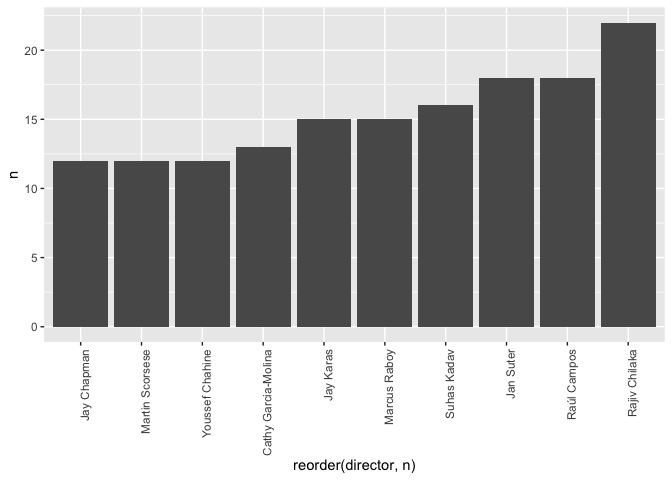
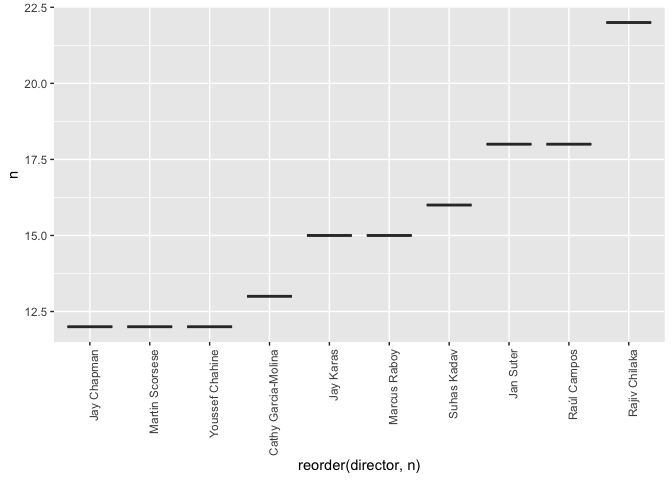
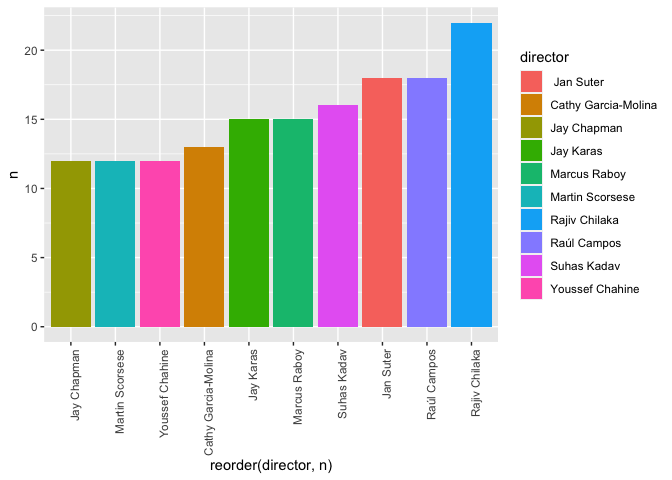
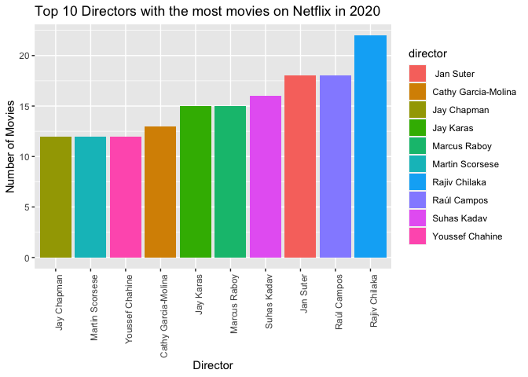

## Overview
Today, we're exploring how AI can aid in writing, comprehending and troubleshooting our R code. AI is a very valuable tool, but it's important not to rely on it entirely. Building a strong R foundation is still important. These AI tools are not perfect and can be inaccurate solutions. In addition these tools can't read our minds, so understanding R helps us generate better prompts to get better responses. In short, AI should be used as a tool, not a crutch. Additionally, do not forget about other useful resources like Stack Overflow/Exchange, online tutorials, and GitHub issues pages for learning and troubleshooting. Let's combine AI with traditional methods to master R effectively.

This overview isn't exhaustive of all possible AI tools for R coding, but I believe it is a good start and covers everything you need.


**Make sure to enable Github Copilot in RStudio.**
Go to Tools -> Global Options -> Copilot -> Enable Git

## Learning Goals: 
*At the end of this exercise, you will be able to:*  
1. Explain what AI is and what AI tools can be used for R.
2. Enable Github Copilot in RStudio.
3. Use Copilot/ChatGPT to write code in RStudio.
4. Use Copilot/ChatGPT for troubleshooting code in RStudio.


## Exploration Questions:
Lets get some get a feel for what copilot (or ChatGPT) does, use Github Copilot to autocomplete the questions below. You can alternatively paste the questions in ChatGPT or Microsoft Copilot.
1. What is AI?
AI is the simulation of human intelligence processes by machines, especially computer systems. These processes include learning, reasoning, and self-correction. Specific applications of AI include expert systems, natural language processing (NLP), speech recognition and machine vision.

2. What is ChatGPT?
ChatGPT is a language model developed by OpenAI. It is a large-scale transformer-based language model that can generate human-like text. It is trained on diverse internet text data and can generate human-like responses to prompts.

3. What is Github Copilot?
Github Copilot is an AI pair programmer that helps you write code faster. It is powered by OpenAI's Codex, a language model trained on a diverse range of internet text data. It can generate code completions, suggest whole lines or blocks of code, and help you find and fix bugs.

4. What is RStudio?
RStudio is an integrated development environment (IDE) for R, a programming language for statistical computing and graphics. It includes a console, syntax-highlighting editor that supports direct code execution, as well as tools for plotting, history, debugging and workspace management.


## Load the libraries  

```r
library(tidyverse)
library(janitor)
library(dplyr)
library(shiny)
library(shinydashboard)
```

## Load the Data: 

```r
#load the Netflix Data in your Data folder, save it under the object name netflix
netflix <- read_csv("Data/netflix_titles.csv")
```

```
## Rows: 8807 Columns: 12
## ── Column specification ────────────────────────────────────────────────────────
## Delimiter: ","
## chr (11): show_id, type, title, director, cast, country, date_added, rating,...
## dbl  (1): release_year
## 
## ℹ Use `spec()` to retrieve the full column specification for this data.
## ℹ Specify the column types or set `show_col_types = FALSE` to quiet this message.
```

*Did copilot help you write the code above? Could anything about the prompt be improved to help Copilot understand what you want to do more accurately?*

## Lets Practice:
Explore the elements in your data: include a comment within your code chunk to prompt Copilot to use the function of your choice

```r
names(netflix)
```

```
##  [1] "show_id"      "type"         "title"        "director"     "cast"        
##  [6] "country"      "date_added"   "release_year" "rating"       "duration"    
## [11] "listed_in"    "description"
```

*Did copilot use your preferred method to get the summary of the data? If not, how could you improve the prompt to get the desired output?*

Sort out the movies from the netflix into an new object called netflix_movies

```r
netflix_movies <- netflix %>% filter(type == "Movie")
```

Which director has the most movies on netflix?

```r
count(netflix_movies, director, sort = TRUE)
```

```
## # A tibble: 4,355 × 2
##    director                   n
##    <chr>                  <int>
##  1 <NA>                     188
##  2 Rajiv Chilaka             19
##  3 Raúl Campos, Jan Suter    18
##  4 Suhas Kadav               16
##  5 Marcus Raboy              15
##  6 Jay Karas                 14
##  7 Cathy Garcia-Molina       13
##  8 Jay Chapman               12
##  9 Martin Scorsese           12
## 10 Youssef Chahine           12
## # ℹ 4,345 more rows
```

*Do you see anything wrong with the table above, look at row 1. Write a prompt below to fix this.*

Which director have the most movies on netflix? remove NA's

```r
count(netflix_movies, director, sort = TRUE) %>% filter(!is.na(director))
```

```
## # A tibble: 4,354 × 2
##    director                   n
##    <chr>                  <int>
##  1 Rajiv Chilaka             19
##  2 Raúl Campos, Jan Suter    18
##  3 Suhas Kadav               16
##  4 Marcus Raboy              15
##  5 Jay Karas                 14
##  6 Cathy Garcia-Molina       13
##  7 Jay Chapman               12
##  8 Martin Scorsese           12
##  9 Youssef Chahine           12
## 10 Steven Spielberg          11
## # ℹ 4,344 more rows
```

Which director had the most movies by release year and remove the NA's?

```r
count(netflix_movies, director, sort = TRUE) %>% filter(!is.na(director)) %>% group_by(director) %>% top_n(1, wt = n)
```

```
## # A tibble: 4,354 × 2
## # Groups:   director [4,354]
##    director                   n
##    <chr>                  <int>
##  1 Rajiv Chilaka             19
##  2 Raúl Campos, Jan Suter    18
##  3 Suhas Kadav               16
##  4 Marcus Raboy              15
##  5 Jay Karas                 14
##  6 Cathy Garcia-Molina       13
##  7 Jay Chapman               12
##  8 Martin Scorsese           12
##  9 Youssef Chahine           12
## 10 Steven Spielberg          11
## # ℹ 4,344 more rows
```

*See anything else interesting about this table, look at the first director on the table. Could this be a problem and how can we edit the dataset to fix this? Try writing a prompt.*

Separate each director into their own row and count the number of movies they have on netflix and remove NAs

```r
netflix_movies %>% separate_rows(director, sep = ",") %>% count(director, sort = TRUE) %>% filter(!is.na(director))
```

```
## # A tibble: 4,886 × 2
##    director                  n
##    <chr>                 <int>
##  1 "Rajiv Chilaka"          22
##  2 " Jan Suter"             18
##  3 "Raúl Campos"            18
##  4 "Suhas Kadav"            16
##  5 "Jay Karas"              15
##  6 "Marcus Raboy"           15
##  7 "Cathy Garcia-Molina"    13
##  8 "Jay Chapman"            12
##  9 "Martin Scorsese"        12
## 10 "Youssef Chahine"        12
## # ℹ 4,876 more rows
```

Make a bar plot of the top directors with the most movies on netflix

```r
netflix_movies %>% separate_rows(director, sep = ",") %>% count(director, sort = TRUE) %>% filter(!is.na(director)) %>% top_n(10, wt = n) %>% ggplot(aes(x = reorder(director, n), y = n)) + geom_bar(stat = "identity") + theme(axis.text.x = element_text(angle = 90, hjust = 1))
```

<!-- -->

*Do you see any issues with this plot? How could we improve the prompt to get a better boxplot? Try writing a prompt.*

Make a boxplot of the top directors with the most movies on netflix

```r
netflix_movies %>% separate_rows(director, sep = ",") %>% count(director, sort = TRUE) %>% filter(!is.na(director)) %>% top_n(10, wt = n) %>% ggplot(aes(x = reorder(director, n), y = n)) + geom_boxplot() + theme(axis.text.x = element_text(angle = 90, hjust = 1))
```

<!-- -->

Make a bar plot of the top directors with the most movies on netflix and make it have color

```r
netflix_movies %>% separate_rows(director, sep = ",") %>% count(director, sort = TRUE) %>% filter(!is.na(director)) %>% top_n(10, wt = n) %>% ggplot(aes(x = reorder(director, n), y = n, fill = director)) + geom_bar(stat = "identity") + theme(axis.text.x = element_text(angle = 90, hjust = 1))
```

<!-- -->

*How about for just 2020*

Make a bar plot of the top directors with the most movies on netflix filter for year 2020

```r
netflix_movies %>% separate_rows(director, sep = ",") %>% count(director, sort = TRUE) %>% filter(!is.na(director)) %>% top_n(10, wt = n) %>% ggplot(aes(x = reorder(director, n), y = n, fill = director)) + geom_bar(stat = "identity") + theme(axis.text.x = element_text(angle = 90, hjust = 1)) + labs(title = "Top 10 Directors with the most movies on Netflix in 2020", x = "Director", y = "Number of Movies") 
```

<!-- -->


*Take a few minutes to make your own plot(s) using prompts, edit prompts until you get a plot that you like.*


## Lets make the top 10 directors barplot into a Shiny App: use copilot or Chatgpt

```r
ui <- fluidPage(
  titlePanel("Top 10 Directors with the most movies on Netflix in 2020"),
  sidebarLayout(
    sidebarPanel(
      helpText("Select the number of movies to display"),
      sliderInput("n", "Number of movies:", value = 10, min = 1, max = 50)
    ),
    mainPanel(
      plotOutput("barplot")
    )
  )
)

server <- function(input, output) {
  output$barplot <- renderPlot({
    netflix_movies %>% separate_rows(director, sep = ",") %>% count(director, sort = TRUE) %>% filter(!is.na(director)) %>% top_n(input$n, wt = n) %>% ggplot(aes(x = reorder(director, n), y = n, fill = director)) + geom_bar(stat = "identity") + theme(axis.text.x = element_text(angle = 90, hjust = 1)) + labs(title = "Top 10 Directors with the most movies on Netflix in 2020", x = "Director", y = "Number of Movies") 
  })
}

shinyApp(ui = ui, server = server)
```

```{=html}
<div style="width: 100% ; height: 400px ; text-align: center; box-sizing: border-box; -moz-box-sizing: border-box; -webkit-box-sizing: border-box;" class="muted well">Shiny applications not supported in static R Markdown documents</div>
```

*Now use ChatGPT, Copilot or previous notes to fix the code*
Make a barplot for the top 10 directors with the most movies on netflix and turn it into a shiny app

```r
ui <- fluidPage(
  titlePanel("Top 10 Directors with the most movies on Netflix in 2020"),
  sidebarLayout(
    sidebarPanel(
      helpText("Select the number of movies to display"),
      sliderInput("n", "Number of movies:", value = 10, min = 1, max = 50)
    ),
    mainPanel(
      plotOutput("barplot")
    )
  )
)

server <- function(input, output) {
  output$barplot <- renderPlot({
    netflix_movies %>% separate_rows(director, sep = ",") %>% count(director, sort = TRUE) %>% filter(!is.na(director)) %>% top_n(input$n, wt = n) %>% ggplot(aes(x = reorder(director, n), y = n, fill = director)) + geom_bar(stat = "identity") + theme(axis.text.x = element_text(angle = 90, hjust = 1)) + labs(title = "Top 10 Directors with the most movies on Netflix in 2020", x = "Director", y = "Number of Movies") 
  })
}

shinyApp(ui = ui, server = server)
```

```{=html}
<div style="width: 100% ; height: 400px ; text-align: center; box-sizing: border-box; -moz-box-sizing: border-box; -webkit-box-sizing: border-box;" class="muted well">Shiny applications not supported in static R Markdown documents</div>
```


## That's it! Let's take a break and then move on to working on group projects.
