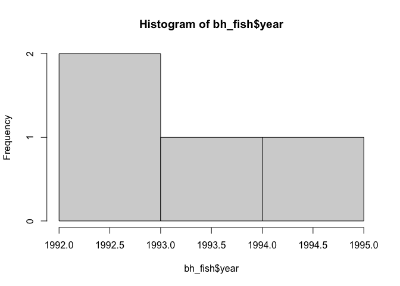

```r
getwd()
```

```
## [1] "/Users/lejla.becirevic/Desktop/BIS15W2024_lbecirevic/lab7"
```

## Instructions
Answer the following questions and complete the exercises in RMarkdown. Please embed all of your code and push your final work to your repository. Your final lab report should be organized, clean, and run free from errors. Remember, you must remove the `#` for the included code chunks to run. Be sure to add your name to the author header above.  

Make sure to use the formatting conventions of RMarkdown to make your report neat and clean!  

## Load the libraries

```r
library(tidyverse)
library(janitor)
library(skimr)
```

For this assignment we are going to work with a large data set from the [United Nations Food and Agriculture Organization](http://www.fao.org/about/en/) on world fisheries. These data are pretty wild, so we need to do some cleaning. First, load the data.  

Load the data `FAO_1950to2012_111914.csv` as a new object titled `fisheries`.

```r
fisheries <- readr::read_csv(file = "data/FAO_1950to2012_111914.csv")
```

```
## Rows: 17692 Columns: 71
## ── Column specification ────────────────────────────────────────────────────────
## Delimiter: ","
## chr (69): Country, Common name, ISSCAAP taxonomic group, ASFIS species#, ASF...
## dbl  (2): ISSCAAP group#, FAO major fishing area
## 
## ℹ Use `spec()` to retrieve the full column specification for this data.
## ℹ Specify the column types or set `show_col_types = FALSE` to quiet this message.
```

1. Do an exploratory analysis of the data (your choice). What are the names of the variables, what are the dimensions, are there any NA's, what are the classes of the variables?  

```r
dim(fisheries)
```

```
## [1] 17692    71
```


```r
names(fisheries)
```

```
##  [1] "Country"                 "Common name"            
##  [3] "ISSCAAP group#"          "ISSCAAP taxonomic group"
##  [5] "ASFIS species#"          "ASFIS species name"     
##  [7] "FAO major fishing area"  "Measure"                
##  [9] "1950"                    "1951"                   
## [11] "1952"                    "1953"                   
## [13] "1954"                    "1955"                   
## [15] "1956"                    "1957"                   
## [17] "1958"                    "1959"                   
## [19] "1960"                    "1961"                   
## [21] "1962"                    "1963"                   
## [23] "1964"                    "1965"                   
## [25] "1966"                    "1967"                   
## [27] "1968"                    "1969"                   
## [29] "1970"                    "1971"                   
## [31] "1972"                    "1973"                   
## [33] "1974"                    "1975"                   
## [35] "1976"                    "1977"                   
## [37] "1978"                    "1979"                   
## [39] "1980"                    "1981"                   
## [41] "1982"                    "1983"                   
## [43] "1984"                    "1985"                   
## [45] "1986"                    "1987"                   
## [47] "1988"                    "1989"                   
## [49] "1990"                    "1991"                   
## [51] "1992"                    "1993"                   
## [53] "1994"                    "1995"                   
## [55] "1996"                    "1997"                   
## [57] "1998"                    "1999"                   
## [59] "2000"                    "2001"                   
## [61] "2002"                    "2003"                   
## [63] "2004"                    "2005"                   
## [65] "2006"                    "2007"                   
## [67] "2008"                    "2009"                   
## [69] "2010"                    "2011"                   
## [71] "2012"
```


```r
anyNA(fisheries)
```

```
## [1] TRUE
```


```r
skim(fisheries)
```


Table: Data summary

|                         |          |
|:------------------------|:---------|
|Name                     |fisheries |
|Number of rows           |17692     |
|Number of columns        |71        |
|_______________________  |          |
|Column type frequency:   |          |
|character                |69        |
|numeric                  |2         |
|________________________ |          |
|Group variables          |None      |


**Variable type: character**

|skim_variable           | n_missing| complete_rate| min| max| empty| n_unique| whitespace|
|:-----------------------|---------:|-------------:|---:|---:|-----:|--------:|----------:|
|Country                 |         0|          1.00|   4|  25|     0|      204|          0|
|Common name             |         0|          1.00|   3|  30|     0|     1553|          0|
|ISSCAAP taxonomic group |         0|          1.00|   5|  36|     0|       30|          0|
|ASFIS species#          |         0|          1.00|  10|  13|     0|     1553|          0|
|ASFIS species name      |         0|          1.00|   6|  32|     0|     1548|          0|
|Measure                 |         0|          1.00|  17|  17|     0|        1|          0|
|1950                    |     15561|          0.12|   1|   6|     0|      513|          0|
|1951                    |     15550|          0.12|   1|   7|     0|      536|          0|
|1952                    |     15501|          0.12|   1|   7|     0|      553|          0|
|1953                    |     15439|          0.13|   1|   6|     0|      570|          0|
|1954                    |     15417|          0.13|   1|   7|     0|      588|          0|
|1955                    |     15382|          0.13|   1|   7|     0|      589|          0|
|1956                    |     15331|          0.13|   1|   7|     0|      633|          0|
|1957                    |     15253|          0.14|   1|   7|     0|      627|          0|
|1958                    |     15138|          0.14|   1|   6|     0|      643|          0|
|1959                    |     15110|          0.15|   1|   7|     0|      641|          0|
|1960                    |     15016|          0.15|   1|   7|     0|      673|          0|
|1961                    |     14922|          0.16|   1|   8|     0|      713|          0|
|1962                    |     14801|          0.16|   1|   8|     0|      729|          0|
|1963                    |     14707|          0.17|   1|   8|     0|      760|          0|
|1964                    |     14349|          0.19|   1|   8|     0|      759|          0|
|1965                    |     14241|          0.20|   1|   8|     0|      798|          0|
|1966                    |     14187|          0.20|   1|   8|     0|      801|          0|
|1967                    |     14047|          0.21|   1|   8|     0|      815|          0|
|1968                    |     13963|          0.21|   1|   8|     0|      829|          0|
|1969                    |     13920|          0.21|   1|   8|     0|      853|          0|
|1970                    |     13113|          0.26|   1|   8|     0|     1225|          0|
|1971                    |     12925|          0.27|   1|   8|     0|     1326|          0|
|1972                    |     12749|          0.28|   1|   8|     0|     1372|          0|
|1973                    |     12673|          0.28|   1|   8|     0|     1432|          0|
|1974                    |     12583|          0.29|   1|   8|     0|     2601|          0|
|1975                    |     12333|          0.30|   1|   8|     0|     2767|          0|
|1976                    |     12177|          0.31|   1|   8|     0|     2804|          0|
|1977                    |     12014|          0.32|   1|   8|     0|     2867|          0|
|1978                    |     11847|          0.33|   1|   8|     0|     2901|          0|
|1979                    |     11820|          0.33|   1|   8|     0|     2932|          0|
|1980                    |     11747|          0.34|   1|   8|     0|     2956|          0|
|1981                    |     11713|          0.34|   1|   8|     0|     2996|          0|
|1982                    |     11558|          0.35|   1|   9|     0|     3030|          0|
|1983                    |     11453|          0.35|   1|   8|     0|     3031|          0|
|1984                    |     11309|          0.36|   1|   8|     0|     3076|          0|
|1985                    |     11212|          0.37|   1|   8|     0|     3161|          0|
|1986                    |     11086|          0.37|   1|   8|     0|     3242|          0|
|1987                    |     10930|          0.38|   1|   8|     0|     3255|          0|
|1988                    |     10493|          0.41|   1|   8|     0|     3435|          0|
|1989                    |     10435|          0.41|   1|   8|     0|     3425|          0|
|1990                    |     10293|          0.42|   1|   8|     0|     3446|          0|
|1991                    |     10364|          0.41|   1|   8|     0|     3420|          0|
|1992                    |     10435|          0.41|   1|   8|     0|     3322|          0|
|1993                    |     10522|          0.41|   1|   8|     0|     3313|          0|
|1994                    |     10400|          0.41|   1|   8|     0|     3313|          0|
|1995                    |     10148|          0.43|   1|   8|     0|     3329|          0|
|1996                    |      9990|          0.44|   1|   7|     0|     3358|          0|
|1997                    |      9773|          0.45|   1|   9|     0|     3393|          0|
|1998                    |      9579|          0.46|   1|   9|     0|     3399|          0|
|1999                    |      9265|          0.48|   1|   9|     0|     3428|          0|
|2000                    |      8899|          0.50|   1|   9|     0|     3481|          0|
|2001                    |      8646|          0.51|   1|   9|     0|     3490|          0|
|2002                    |      8590|          0.51|   1|   9|     0|     3507|          0|
|2003                    |      8383|          0.53|   1|   9|     0|     3482|          0|
|2004                    |      7977|          0.55|   1|   9|     0|     3505|          0|
|2005                    |      7822|          0.56|   1|   9|     0|     3532|          0|
|2006                    |      7699|          0.56|   1|   9|     0|     3565|          0|
|2007                    |      7589|          0.57|   1|   8|     0|     3551|          0|
|2008                    |      7667|          0.57|   1|   8|     0|     3537|          0|
|2009                    |      7573|          0.57|   1|   8|     0|     3572|          0|
|2010                    |      7499|          0.58|   1|   8|     0|     3590|          0|
|2011                    |      7371|          0.58|   1|   8|     0|     3618|          0|
|2012                    |      7336|          0.59|   1|   8|     0|     3609|          0|


**Variable type: numeric**

|skim_variable          | n_missing| complete_rate|  mean|    sd| p0| p25| p50| p75| p100|hist  |
|:----------------------|---------:|-------------:|-----:|-----:|--:|---:|---:|---:|----:|:-----|
|ISSCAAP group#         |         0|             1| 37.38|  7.88| 11|  33|  36|  38|   77|▁▇▂▁▁ |
|FAO major fishing area |         0|             1| 45.34| 18.33| 18|  31|  37|  57|   88|▇▇▆▃▃ |

2. Use `janitor` to rename the columns and make them easier to use. As part of this cleaning step, change `country`, `isscaap_group_number`, `asfis_species_number`, and `fao_major_fishing_area` to data class factor. 

```r
fisheries <- clean_names(fisheries)
```

We need to deal with the years because they are being treated as characters and start with an X. We also have the problem that the column names that are years actually represent data. We haven't discussed tidy data yet, so here is some help. You should run this ugly chunk to transform the data for the rest of the homework. It will only work if you have used janitor to rename the variables in question 2!  

```r
fisheries_tidy <- fisheries %>% 
pivot_longer(-c(country,common_name,isscaap_group_number,isscaap_taxonomic_group,asfis_species_number,asfis_species_name,fao_major_fishing_area,measure),
names_to = "year",
values_to = "catch",
values_drop_na = TRUE) %>% 
mutate(year= as.numeric(str_replace(year, 'x', ''))) %>% 
mutate(catch= str_replace(catch, c(' F'), replacement = '')) %>% 
mutate(catch= str_replace(catch, c('...'), replacement = '')) %>% 
mutate(catch= str_replace(catch, c('-'), replacement = '')) %>% 
mutate(catch= str_replace(catch, c('0 0'), replacement = ''))

fisheries_tidy$catch <- as.numeric(fisheries_tidy$catch)
```

3. How many countries are represented in the data? Provide a count and list their names.

```r
fisheries_tidy %>% 
  group_by(country) %>% 
  summarize(n=n()) %>% 
  arrange(desc(n)) #there is 203 countries
```

```
## # A tibble: 203 × 2
##    country                      n
##    <chr>                    <int>
##  1 United States of America 18080
##  2 Spain                    17482
##  3 Japan                    15429
##  4 Portugal                 11570
##  5 Korea, Republic of       10824
##  6 France                   10639
##  7 Taiwan Province of China  9927
##  8 Indonesia                 9274
##  9 Australia                 8183
## 10 Un. Sov. Soc. Rep.        7084
## # ℹ 193 more rows
```

4. Refocus the data only to include country, isscaap_taxonomic_group, asfis_species_name, asfis_species_number, year, catch.

```r
fish <- fisheries_tidy %>% 
  select(country, isscaap_taxonomic_group, asfis_species_name, asfis_species_number, year, catch)
```

5. Based on the asfis_species_number, how many distinct fish species were caught as part of these data?

```r
fish %>% 
  group_by(asfis_species_name, asfis_species_number) %>% 
  summarize(n=n(), .groups= 'keep') %>% 
  arrange(desc(n)) #there was 1,551 species
```

```
## # A tibble: 1,551 × 3
## # Groups:   asfis_species_name, asfis_species_number [1,551]
##    asfis_species_name asfis_species_number     n
##    <chr>              <chr>                <int>
##  1 Osteichthyes       199XXXXXXX010        14289
##  2 Thunnus albacares  1750102610            6866
##  3 Elasmobranchii     199XXXXXXX054         6405
##  4 Katsuwonus pelamis 1750102501            5785
##  5 Thunnus obesus     1750102612            5341
##  6 Xiphias gladius    1750400301            5143
##  7 Thunnus alalunga   1750102605            4441
##  8 Mugilidae          16501XXXXX            4141
##  9 Rajiformes         110XXXXXXX            3706
## 10 Mollusca           399XXXXXXX016         3516
## # ℹ 1,541 more rows
```

6. Which country had the largest overall catch in the year 2000?

```r
fish %>% 
  filter(year==2000) %>% 
  arrange(desc(catch)) #the country that had the highest catch is China
```

```
## # A tibble: 8,793 × 6
##    country  isscaap_taxonomic_gr…¹ asfis_species_name asfis_species_number  year
##    <chr>    <chr>                  <chr>              <chr>                <dbl>
##  1 China    Marine fishes not ide… Osteichthyes       199XXXXXXX010         2000
##  2 Peru     Herrings, sardines, a… Engraulis ringens  1210600208            2000
##  3 Russian… Cods, hakes, haddocks  Theragra chalcogr… 1480401601            2000
##  4 Viet Nam Marine fishes not ide… Osteichthyes       199XXXXXXX010         2000
##  5 Chile    Miscellaneous pelagic… Trachurus murphyi  1702300405            2000
##  6 China    Miscellaneous marine … Mollusca           399XXXXXXX016         2000
##  7 China    Miscellaneous demersa… Trichiurus leptur… 1750600302            2000
##  8 United … Cods, hakes, haddocks  Theragra chalcogr… 1480401601            2000
##  9 China    Miscellaneous marine … Crustacea          299XXXXXXX013         2000
## 10 Philipp… Miscellaneous pelagic… Decapterus spp     17023043XX            2000
## # ℹ 8,783 more rows
## # ℹ abbreviated name: ¹​isscaap_taxonomic_group
## # ℹ 1 more variable: catch <dbl>
```


7. Which country caught the most sardines (_Sardina pilchardus_) between the years 1990-2000?

```r
fish %>% 
  filter(between(year, 1990, 2000)) %>% 
  filter(asfis_species_name=="Sardina pilchardus") %>% 
  arrange(desc(catch)) #the country that had the most sardines is Morocco
```

```
## # A tibble: 336 × 6
##    country  isscaap_taxonomic_gr…¹ asfis_species_name asfis_species_number  year
##    <chr>    <chr>                  <chr>              <chr>                <dbl>
##  1 Morocco  Herrings, sardines, a… Sardina pilchardus 1210506401            1994
##  2 Morocco  Herrings, sardines, a… Sardina pilchardus 1210506401            1996
##  3 Spain    Herrings, sardines, a… Sardina pilchardus 1210506401            1996
##  4 Morocco  Herrings, sardines, a… Sardina pilchardus 1210506401            2000
##  5 Morocco  Herrings, sardines, a… Sardina pilchardus 1210506401            1990
##  6 Morocco  Herrings, sardines, a… Sardina pilchardus 1210506401            1991
##  7 Morocco  Herrings, sardines, a… Sardina pilchardus 1210506401            1998
##  8 Morocco  Herrings, sardines, a… Sardina pilchardus 1210506401            1993
##  9 Russian… Herrings, sardines, a… Sardina pilchardus 1210506401            1992
## 10 Russian… Herrings, sardines, a… Sardina pilchardus 1210506401            1991
## # ℹ 326 more rows
## # ℹ abbreviated name: ¹​isscaap_taxonomic_group
## # ℹ 1 more variable: catch <dbl>
```

8. Which five countries caught the most cephalopods between 2008-2012?

```r
fish %>% 
  filter(between(year, 2008, 2012)) %>% 
  filter(asfis_species_name=="Cephalopoda") %>% 
  arrange(desc(catch)) #the five countries that caught the most cephalopods was India, China, Italy, Spain, and Algeria
```

```
## # A tibble: 80 × 6
##    country isscaap_taxonomic_group asfis_species_name asfis_species_number  year
##    <chr>   <chr>                   <chr>              <chr>                <dbl>
##  1 India   Squids, cuttlefishes, … Cephalopoda        321XXXXXXX            2011
##  2 India   Squids, cuttlefishes, … Cephalopoda        321XXXXXXX            2010
##  3 India   Squids, cuttlefishes, … Cephalopoda        321XXXXXXX            2012
##  4 China   Squids, cuttlefishes, … Cephalopoda        321XXXXXXX            2008
##  5 China   Squids, cuttlefishes, … Cephalopoda        321XXXXXXX            2010
##  6 Italy   Squids, cuttlefishes, … Cephalopoda        321XXXXXXX            2012
##  7 India   Squids, cuttlefishes, … Cephalopoda        321XXXXXXX            2009
##  8 India   Squids, cuttlefishes, … Cephalopoda        321XXXXXXX            2009
##  9 India   Squids, cuttlefishes, … Cephalopoda        321XXXXXXX            2010
## 10 Spain   Squids, cuttlefishes, … Cephalopoda        321XXXXXXX            2008
## # ℹ 70 more rows
## # ℹ 1 more variable: catch <dbl>
```

9. Which species had the highest catch total between 2008-2012? (hint: Osteichthyes is not a species)

```r
fish %>% 
  filter(between(year, 2008, 2012)) %>% 
  filter(!asfis_species_name=="Osteichthyes") %>% 
  arrange(desc(catch)) # the species with the highest catch total was Trichiurus lepturus
```

```
## # A tibble: 49,554 × 6
##    country  isscaap_taxonomic_gr…¹ asfis_species_name asfis_species_number  year
##    <chr>    <chr>                  <chr>              <chr>                <dbl>
##  1 China    Miscellaneous demersa… Trichiurus leptur… 1750600302            2011
##  2 Russian… Cods, hakes, haddocks  Theragra chalcogr… 1480401601            2012
##  3 Peru     Herrings, sardines, a… Engraulis ringens  1210600208            2008
##  4 Norway   Herrings, sardines, a… Clupea harengus    1210500105            2008
##  5 Norway   Herrings, sardines, a… Clupea harengus    1210500105            2009
##  6 Peru     Herrings, sardines, a… Engraulis ringens  1210600208            2012
##  7 China    Miscellaneous demersa… Trichiurus leptur… 1750600302            2010
##  8 Chile    Herrings, sardines, a… Engraulis ringens  1210600208            2008
##  9 China    Miscellaneous demersa… Trichiurus leptur… 1750600302            2012
## 10 Russian… Cods, hakes, haddocks  Theragra chalcogr… 1480401601            2009
## # ℹ 49,544 more rows
## # ℹ abbreviated name: ¹​isscaap_taxonomic_group
## # ℹ 1 more variable: catch <dbl>
```

10. Use the data to do at least one analysis of your choice.

```r
bh_fish <- fisheries_tidy %>% 
  select(country, common_name, year, catch) %>% 
  filter(country=="Bosnia and Herzegovina") %>% 
  filter(between(year, 1992, 1995)) 
bh_fish
```

```
## # A tibble: 4 × 4
##   country                common_name        year catch
##   <chr>                  <chr>             <dbl> <dbl>
## 1 Bosnia and Herzegovina Marine fishes nei  1992     1
## 2 Bosnia and Herzegovina Marine fishes nei  1993     1
## 3 Bosnia and Herzegovina Marine fishes nei  1994     1
## 4 Bosnia and Herzegovina Marine fishes nei  1995     1
```


```r
hist(bh_fish$year)
```

<!-- -->


## Push your final code to GitHub!
Please be sure that you check the `keep md` file in the knit preferences.   
