```r
getwd()
```

```
## [1] "/Users/lejla.becirevic/Desktop/BIS15W2024_lbecirevic/midterm_notes/m2"
```


```r
library(tidyverse)
library(janitor)
library(skimr)
library(naniar)
library(visdat)
library(here)
library(palmerpenguins)
library(RColorBrewer)
library(paletteer)
```


```r
options(scipen=999) #cancels the use of scientific notation for the session
```

## LAB 8

**summarize() and group_by() are powerful tools that we can use to produce clean summaries of data. Especially when used together, we can quickly group variables of interest and save time**

```r
print(penguins)
```

```
## # A tibble: 344 × 8
##    species island    bill_length_mm bill_depth_mm flipper_length_mm body_mass_g
##    <fct>   <fct>              <dbl>         <dbl>             <int>       <int>
##  1 Adelie  Torgersen           39.1          18.7               181        3750
##  2 Adelie  Torgersen           39.5          17.4               186        3800
##  3 Adelie  Torgersen           40.3          18                 195        3250
##  4 Adelie  Torgersen           NA            NA                  NA          NA
##  5 Adelie  Torgersen           36.7          19.3               193        3450
##  6 Adelie  Torgersen           39.3          20.6               190        3650
##  7 Adelie  Torgersen           38.9          17.8               181        3625
##  8 Adelie  Torgersen           39.2          19.6               195        4675
##  9 Adelie  Torgersen           34.1          18.1               193        3475
## 10 Adelie  Torgersen           42            20.2               190        4250
## # ℹ 334 more rows
## # ℹ 2 more variables: sex <fct>, year <int>
```

**Produce a summary of the mean for bill_length_mm, bill_depth_mm, flipper_length_mm, and body_mass_g within Adelie penguins only. Be sure to provide the number of samples**

```r
penguins %>% 
  filter(species=="Adelie") %>% 
  summarize(mean_bill_length=mean(bill_length_mm, na.rm = T),
            mean_bill_depth=mean(bill_depth_mm, na.rm = T),
            mean_flippper_length=mean(flipper_length_mm, na.rm = T),
            mean_body_mass=mean(body_mass_g, na.rm = T),
            n=n())
```

```
## # A tibble: 1 × 5
##   mean_bill_length mean_bill_depth mean_flippper_length mean_body_mass     n
##              <dbl>           <dbl>                <dbl>          <dbl> <int>
## 1             38.8            18.3                 190.          3701.   152
```

### across()
**Function in dplyr called `across()` which can count for multiple variables**

**Use `summarize()` to produce distinct counts over multiple variables; i.e. species, island, and sex?** 

```r
penguins %>%
  summarize(distinct_species = n_distinct(species),
            distinct_island = n_distinct(island),
            distinct_sex = n_distinct(sex))
```

```
## # A tibble: 1 × 3
##   distinct_species distinct_island distinct_sex
##              <int>           <int>        <int>
## 1                3               3            3
```

**By using `across()` we can reduce the clutter and make things cleaner**

```r
penguins %>%
  summarize(across(c(species, island, sex), n_distinct))
```

```
## # A tibble: 1 × 3
##   species island   sex
##     <int>  <int> <int>
## 1       3      3     3
```

**This is very helpful for continuous variables**

```r
penguins %>%
  summarize(across(contains("mm"), mean, na.rm=T))
```

```
## Warning: There was 1 warning in `summarize()`.
## ℹ In argument: `across(contains("mm"), mean, na.rm = T)`.
## Caused by warning:
## ! The `...` argument of `across()` is deprecated as of dplyr 1.1.0.
## Supply arguments directly to `.fns` through an anonymous function instead.
## 
##   # Previously
##   across(a:b, mean, na.rm = TRUE)
## 
##   # Now
##   across(a:b, \(x) mean(x, na.rm = TRUE))
```

```
## # A tibble: 1 × 3
##   bill_length_mm bill_depth_mm flipper_length_mm
##            <dbl>         <dbl>             <dbl>
## 1           43.9          17.2              201.
```

**group_by also works**

```r
penguins %>%
  group_by(sex) %>% 
  summarize(across(contains("mm"), mean, na.rm=T))
```

```
## # A tibble: 3 × 4
##   sex    bill_length_mm bill_depth_mm flipper_length_mm
##   <fct>           <dbl>         <dbl>             <dbl>
## 1 female           42.1          16.4              197.
## 2 male             45.9          17.9              205.
## 3 <NA>             41.3          16.6              199
```

**Here we summarize across all variables**

```r
penguins %>%
  summarise_all(n_distinct)
```

```
## # A tibble: 1 × 8
##   species island bill_length_mm bill_depth_mm flipper_length_mm body_mass_g
##     <int>  <int>          <int>         <int>             <int>       <int>
## 1       3      3            165            81                56          95
## # ℹ 2 more variables: sex <int>, year <int>
```

**Operators can also work, here I am summarizing n_distinct() across all variables except species, island, and sex**

```r
penguins %>%
  summarize(across(!c(species, island, sex, year), 
                   mean, na.rm=T))
```

```
## # A tibble: 1 × 4
##   bill_length_mm bill_depth_mm flipper_length_mm body_mass_g
##            <dbl>         <dbl>             <dbl>       <dbl>
## 1           43.9          17.2              201.       4202.
```

**All variables that include "bill"...all of the other dplyr operators also work**

```r
penguins %>%
  summarise(across(starts_with("bill"), n_distinct))
```

```
## # A tibble: 1 × 2
##   bill_length_mm bill_depth_mm
##            <int>         <int>
## 1            165            81
```

**Produce separate summaries of the mean and standard deviation for bill_length_mm, bill_depth_mm, and flipper_length_mm for each penguin species. Be sure to provide the number of samples**

```r
penguins %>% 
  group_by(species) %>% 
  summarise(across(c(contains("mm"), body_mass_g), mean, na.rm=T), #included variable after contains "mm" with the c() function, can also add stuff after
            n=n())
```

```
## # A tibble: 3 × 6
##   species   bill_length_mm bill_depth_mm flipper_length_mm body_mass_g     n
##   <fct>              <dbl>         <dbl>             <dbl>       <dbl> <int>
## 1 Adelie              38.8          18.3              190.       3701.   152
## 2 Chinstrap           48.8          18.4              196.       3733.    68
## 3 Gentoo              47.5          15.0              217.       5076.   124
```


```r
getwd()
```

```
## [1] "/Users/lejla.becirevic/Desktop/BIS15W2024_lbecirevic/midterm_notes/m2"
```

**Load the mammals life history data and clean the names**

```r
life_history <- read_csv("data/mammal_lifehistories_v3.csv") %>% clean_names()
```

```
## Rows: 1440 Columns: 13
## ── Column specification ────────────────────────────────────────────────────────
## Delimiter: ","
## chr (5): order, family, Genus, species, newborn
## dbl (8): mass, gestation, weaning, wean mass, AFR, max. life, litter size, l...
## 
## ℹ Use `spec()` to retrieve the full column specification for this data.
## ℹ Specify the column types or set `show_col_types = FALSE` to quiet this message.
```

**Here is a new one for you using the `purrr` package. This will give you a quick summary of the number of NA's in each variable.**

```r
life_history %>% 
  map_df(~ sum(is.na(.)))
```

```
## # A tibble: 1 × 13
##   order family genus species  mass gestation newborn weaning wean_mass   afr
##   <int>  <int> <int>   <int> <int>     <int>   <int>   <int>     <int> <int>
## 1     0      0     0       0     0         0       0       0         0     0
## # ℹ 3 more variables: max_life <int>, litter_size <int>, litters_year <int>
```

**A single approach to deal with NA's in this data set**

```r
life_history <- read_csv("data/mammal_lifehistories_v3.csv", na= c("NA", " ", ".", "-999", "not measured")) %>% clean_names() # you nee to know how the NAs are represented in the data; you dont want to do this by default
```

```
## Warning: One or more parsing issues, call `problems()` on your data frame for details,
## e.g.:
##   dat <- vroom(...)
##   problems(dat)
```

```
## Rows: 1440 Columns: 13
## ── Column specification ────────────────────────────────────────────────────────
## Delimiter: ","
## chr (4): order, family, Genus, species
## dbl (9): mass, gestation, newborn, weaning, wean mass, AFR, max. life, litte...
## 
## ℹ Use `spec()` to retrieve the full column specification for this data.
## ℹ Specify the column types or set `show_col_types = FALSE` to quiet this message.
```

### naniar
**naniar is a package that is built to manage NA's**

**miss_var_summary provides a clean summary of NA's across the data frame**

```r
naniar::miss_var_summary(life_history)
```

```
## # A tibble: 13 × 3
##    variable     n_miss pct_miss
##    <chr>         <int>    <dbl>
##  1 wean_mass      1039    72.2 
##  2 litters_year    689    47.8 
##  3 weaning         619    43.0 
##  4 afr             607    42.2 
##  5 newborn         595    41.3 
##  6 gestation       418    29.0 
##  7 mass             85     5.90
##  8 litter_size      84     5.83
##  9 order             0     0   
## 10 family            0     0   
## 11 genus             0     0   
## 12 species           0     0   
## 13 max_life          0     0
```

**Let's use mutate() and na_if() to replace 0's with NA's**

```r
life_history <- 
  life_history %>% 
  mutate(max_life=na_if(max_life, 0))
```

**We can also use `miss_var_summary` with `group_by()`. This helps us better evaluate where NA's are in the data.**

```r
life_history %>%
  group_by(order) %>%
  select(order, wean_mass) %>% 
  miss_var_summary(order=T)
```

```
## # A tibble: 17 × 4
## # Groups:   order [17]
##    order          variable  n_miss pct_miss
##    <chr>          <chr>      <int>    <dbl>
##  1 Artiodactyla   wean_mass    134     83.2
##  2 Carnivora      wean_mass    120     60.9
##  3 Cetacea        wean_mass     51     92.7
##  4 Dermoptera     wean_mass      2    100  
##  5 Hyracoidea     wean_mass      3     75  
##  6 Insectivora    wean_mass     67     73.6
##  7 Lagomorpha     wean_mass     28     66.7
##  8 Macroscelidea  wean_mass      8     80  
##  9 Perissodactyla wean_mass     12     80  
## 10 Pholidota      wean_mass      3     42.9
## 11 Primates       wean_mass    108     69.2
## 12 Proboscidea    wean_mass      1     50  
## 13 Rodentia       wean_mass    474     71.3
## 14 Scandentia     wean_mass      5     71.4
## 15 Sirenia        wean_mass      4     80  
## 16 Tubulidentata  wean_mass      0      0  
## 17 Xenarthra      wean_mass     19     95
```

**naniar also has a nice replace function which will allow you to precisely control which values you want replaced with NA's in each variable.**

```r
life_history %>% 
  replace_with_na(replace = list(newborn = "not measured", 
                                 weaning= -999, 
                                 wean_mass= -999, 
                                 afr= -999, 
                                 max_life= 0, 
                                 litter_size= -999, 
                                 gestation= -999, 
                                 mass= -999)) %>% 
miss_var_summary() #makes replacement of NAs specific with variable
```

```
## # A tibble: 13 × 3
##    variable     n_miss pct_miss
##    <chr>         <int>    <dbl>
##  1 wean_mass      1039    72.2 
##  2 max_life        841    58.4 
##  3 litters_year    689    47.8 
##  4 weaning         619    43.0 
##  5 afr             607    42.2 
##  6 newborn         595    41.3 
##  7 gestation       418    29.0 
##  8 mass             85     5.90
##  9 litter_size      84     5.83
## 10 order             0     0   
## 11 family            0     0   
## 12 genus             0     0   
## 13 species           0     0
```

**Import the data and do a little exploration. Be sure to clean the names if necessary.

```r
cites <- read_csv("data/cites.csv") %>% clean_names()
```

```
## Rows: 67161 Columns: 16
## ── Column specification ────────────────────────────────────────────────────────
## Delimiter: ","
## chr (13): App., Taxon, Class, Order, Family, Genus, Importer, Exporter, Orig...
## dbl  (3): Year, Importer reported quantity, Exporter reported quantity
## 
## ℹ Use `spec()` to retrieve the full column specification for this data.
## ℹ Specify the column types or set `show_col_types = FALSE` to quiet this message.
```

**Try using `group_by()` with `naniar`. Look specifically at class and `exporter_reported_quantity`. For which taxonomic classes do we have a high proportion of missing export data?**

```r
cites %>% 
  select(class, exporter_reported_quantity) %>% 
  group_by(class) %>%
  miss_var_summary() %>% 
  arrange(desc(pct_miss))
```

```
## # A tibble: 17 × 4
## # Groups:   class [17]
##    class          variable                   n_miss pct_miss
##    <chr>          <chr>                       <int>    <dbl>
##  1 Holothuroidea  exporter_reported_quantity     10    100  
##  2 Dipneusti      exporter_reported_quantity      3     75  
##  3 Bivalvia       exporter_reported_quantity    165     61.3
##  4 Gastropoda     exporter_reported_quantity    104     54.5
##  5 Elasmobranchii exporter_reported_quantity     58     51.3
##  6 Arachnida      exporter_reported_quantity     32     47.8
##  7 Amphibia       exporter_reported_quantity    190     45.2
##  8 Anthozoa       exporter_reported_quantity   3858     43.9
##  9 Mammalia       exporter_reported_quantity   3731     43.9
## 10 <NA>           exporter_reported_quantity   7002     34.6
## 11 Hydrozoa       exporter_reported_quantity     61     33.7
## 12 Hirudinoidea   exporter_reported_quantity     11     32.4
## 13 Reptilia       exporter_reported_quantity   5323     28.9
## 14 Actinopteri    exporter_reported_quantity    726     26.3
## 15 Aves           exporter_reported_quantity   1792     26.1
## 16 Insecta        exporter_reported_quantity     74     23.9
## 17 Coelacanthi    exporter_reported_quantity      0      0
```

### Visualizing NAs

```r
vis_dat(life_history) #classes of data
```

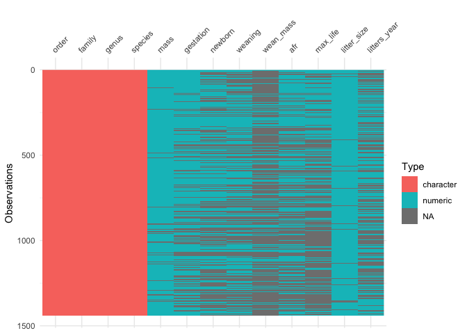<!-- -->


```r
vis_miss(life_history)
```

<!-- -->

### Dealing with NA's in advance
**If you are sure that you know how NA's are treated in the data, then you can deal with them in advance using `na()` as part of the `readr` package.**

```r
life_history_advance <- 
  readr::read_csv(file = "data/mammal_lifehistories_v3.csv", 
                  na = c("NA", " ", ".", "-999")) #all NA, blank spaces, .,and -999 are treated as NA
```

```
## Warning: One or more parsing issues, call `problems()` on your data frame for details,
## e.g.:
##   dat <- vroom(...)
##   problems(dat)
```

```
## Rows: 1440 Columns: 13
## ── Column specification ────────────────────────────────────────────────────────
## Delimiter: ","
## chr (5): order, family, Genus, species, newborn
## dbl (8): mass, gestation, weaning, wean mass, AFR, max. life, litter size, l...
## 
## ℹ Use `spec()` to retrieve the full column specification for this data.
## ℹ Specify the column types or set `show_col_types = FALSE` to quiet this message.
```


## LAB 9
### pivot_longer  
**Scientists frequently use spreadsheets that are organized to make data entry efficient. This is often referred to as wide format. Unfortunately, the wide format creates a problem because column names may actually represent values of a variable. The command `pivot_longer()` shifts data from wide to long format.**   

**Rules:** 
+ `pivot_longer`(cols, names_to, values_to)
+ `cols` - Columns to pivot to longer format
+ `names_to` - Name of the new column; it will contain the column names of gathered columns as values
+ `values_to` - Name of the new column; it will contain the data stored in the values of gathered columns

**Assess whether or not the data are tidy.**  
(1) each variable has its own column?  
(2) each observation has its own row? 
(3) each value has its own cell?  
  
**To fix this problem, we need to reshape the table to long format while keeping track of column names and values. We do this using `pivot_longer()`. Notice that the dimensions of the data frame change.**


```r
heartrate <- read_csv("data/heartrate.csv")
```

```
## Rows: 6 Columns: 5
## ── Column specification ────────────────────────────────────────────────────────
## Delimiter: ","
## chr (1): patient
## dbl (4): a, b, c, d
## 
## ℹ Use `spec()` to retrieve the full column specification for this data.
## ℹ Specify the column types or set `show_col_types = FALSE` to quiet this message.
```


```r
heartrate %>% 
  pivot_longer(-patient, #patient will not move
               names_to = "drug", #make a new column called "drug"
               values_to="heartrate" #values moved to a new column called "heartrate"
               )
```

```
## # A tibble: 24 × 3
##    patient  drug  heartrate
##    <chr>    <chr>     <dbl>
##  1 Margaret a            72
##  2 Margaret b            74
##  3 Margaret c            80
##  4 Margaret d            68
##  5 Frank    a            84
##  6 Frank    b            84
##  7 Frank    c            88
##  8 Frank    d            76
##  9 Hawkeye  a            64
## 10 Hawkeye  b            66
## # ℹ 14 more rows
```

**Examples**
Import the file `relig_income.csv` and store it as a new object `relig_income`.  

```r
relig_income <- read_csv("data/relig_income.csv")
```

```
## Rows: 18 Columns: 11
## ── Column specification ────────────────────────────────────────────────────────
## Delimiter: ","
## chr  (1): religion
## dbl (10): <$10k, $10-20k, $20-30k, $30-40k, $40-50k, $50-75k, $75-100k, $100...
## 
## ℹ Use `spec()` to retrieve the full column specification for this data.
## ℹ Specify the column types or set `show_col_types = FALSE` to quiet this message.
```

Use `pivot_longer()` to make the data tidy.  

```r
relig_income %>% 
  pivot_longer(-religion,
               names_to = "income",
               values_to = "total")
```

```
## # A tibble: 180 × 3
##    religion income             total
##    <chr>    <chr>              <dbl>
##  1 Agnostic <$10k                 27
##  2 Agnostic $10-20k               34
##  3 Agnostic $20-30k               60
##  4 Agnostic $30-40k               81
##  5 Agnostic $40-50k               76
##  6 Agnostic $50-75k              137
##  7 Agnostic $75-100k             122
##  8 Agnostic $100-150k            109
##  9 Agnostic >150k                 84
## 10 Agnostic Don't know/refused    96
## # ℹ 170 more rows
```

Some (but not all) of the column names are data. We also have NA's.

```r
billboard <- read_csv("data/billboard.csv")
```

```
## Rows: 317 Columns: 79
## ── Column specification ────────────────────────────────────────────────────────
## Delimiter: ","
## chr   (2): artist, track
## dbl  (65): wk1, wk2, wk3, wk4, wk5, wk6, wk7, wk8, wk9, wk10, wk11, wk12, wk...
## lgl  (11): wk66, wk67, wk68, wk69, wk70, wk71, wk72, wk73, wk74, wk75, wk76
## date  (1): date.entered
## 
## ℹ Use `spec()` to retrieve the full column specification for this data.
## ℹ Specify the column types or set `show_col_types = FALSE` to quiet this message.
```

Solution 1: specify a range of columns that you want to pivot.

```r
billboard2 <- 
  billboard %>% 
  pivot_longer(wk1:wk76, # a range of columns
               names_to = "week",
               values_to = "rank", 
               values_drop_na = TRUE #this will drop the NA's
               )
```

Solution 2: OR, specify columns that you want to stay fixed.

```r
billboard3 <- 
  billboard %>% 
  pivot_longer(-c(artist, track, date.entered), #specific columns to stay fixed
               names_to = "week",
               values_to = "rank",
               values_drop_na = TRUE
               )
```

Solution 3: identify columns by a prefix, remove the prefix and all NA's.

```r
billboard %>% 
   pivot_longer(
   cols = starts_with("wk"), #columns that start with "wk"
   names_to = "week",
   names_prefix = "wk",
   values_to = "rank",
   values_drop_na = TRUE)
```

```
## # A tibble: 5,307 × 5
##    artist  track                   date.entered week   rank
##    <chr>   <chr>                   <date>       <chr> <dbl>
##  1 2 Pac   Baby Don't Cry (Keep... 2000-02-26   1        87
##  2 2 Pac   Baby Don't Cry (Keep... 2000-02-26   2        82
##  3 2 Pac   Baby Don't Cry (Keep... 2000-02-26   3        72
##  4 2 Pac   Baby Don't Cry (Keep... 2000-02-26   4        77
##  5 2 Pac   Baby Don't Cry (Keep... 2000-02-26   5        87
##  6 2 Pac   Baby Don't Cry (Keep... 2000-02-26   6        94
##  7 2 Pac   Baby Don't Cry (Keep... 2000-02-26   7        99
##  8 2Ge+her The Hardest Part Of ... 2000-09-02   1        91
##  9 2Ge+her The Hardest Part Of ... 2000-09-02   2        87
## 10 2Ge+her The Hardest Part Of ... 2000-09-02   3        92
## # ℹ 5,297 more rows
```

Import `plant_data.csv` as a new object `plant_data`.  

```r
plant_data <- read_csv("data/plant_data.csv")
```

```
## Rows: 3 Columns: 33
## ── Column specification ────────────────────────────────────────────────────────
## Delimiter: ","
## chr  (3): genotype, water_sched_prog, greenhouse
## dbl (30): day1, day2, day3, day4, day5, day6, day7, day8, day9, day10, day11...
## 
## ℹ Use `spec()` to retrieve the full column specification for this data.
## ℹ Specify the column types or set `show_col_types = FALSE` to quiet this message.
```

Use `pivot_longer()` to make the data tidy. Focus the data only on genotype, water_sched_prog, and greenhouse.  

```r
plant_data %>% 
  pivot_longer(-c(genotype, water_sched_prog, greenhouse),
               names_to = "day",
               values_to = "v2",
               values_drop_na = TRUE)
```

```
## # A tibble: 90 × 5
##    genotype water_sched_prog greenhouse day      v2
##    <chr>    <chr>            <chr>      <chr> <dbl>
##  1 control  A                A761       day1   21.7
##  2 control  A                A761       day2   19.9
##  3 control  A                A761       day3   20.7
##  4 control  A                A761       day4   19.4
##  5 control  A                A761       day5   20.2
##  6 control  A                A761       day6   19.2
##  7 control  A                A761       day7   20.6
##  8 control  A                A761       day8   19.9
##  9 control  A                A761       day9   19.2
## 10 control  A                A761       day10  20.4
## # ℹ 80 more rows
```

Recall that we use `pivot_longer()` when our column names actually represent variables. A classic example would be that the column names represent observations of a variable.

```r
datasets::USPersonalExpenditure
```

```
##                       1940   1945  1950 1955  1960
## Food and Tobacco    22.200 44.500 59.60 73.2 86.80
## Household Operation 10.500 15.500 29.00 36.5 46.20
## Medical and Health   3.530  5.760  9.71 14.0 21.10
## Personal Care        1.040  1.980  2.45  3.4  5.40
## Private Education    0.341  0.974  1.80  2.6  3.64
```

```r
?USPersonalExpenditure
```

Here we add a new column of expenditure types, which are stored as rownames above, with `mutate()`. The `USPersonalExpenditures` data also needs to be converted to a data frame before we can use the tidyverse functions, because it comes as a matrix.

```r
expenditures <- USPersonalExpenditure %>% 
  as_tibble() %>% #this transforms the matrix into a data frame
  mutate(expenditure = rownames(USPersonalExpenditure))
```

Are these data tidy? Please use `pivot_longer()` to tidy the data.

```r
expenditures %>% 
  pivot_longer(-expenditure, #not moving expenditure 
               names_to = "year", #make new variable = year
               values_to = "bn_dollars") #moving values into bn_dollars
```

```
## # A tibble: 25 × 3
##    expenditure         year  bn_dollars
##    <chr>               <chr>      <dbl>
##  1 Food and Tobacco    1940        22.2
##  2 Food and Tobacco    1945        44.5
##  3 Food and Tobacco    1950        59.6
##  4 Food and Tobacco    1955        73.2
##  5 Food and Tobacco    1960        86.8
##  6 Household Operation 1940        10.5
##  7 Household Operation 1945        15.5
##  8 Household Operation 1950        29  
##  9 Household Operation 1955        36.5
## 10 Household Operation 1960        46.2
## # ℹ 15 more rows
```

Restrict the data to medical and health expenditures only. Sort in ascending order.

```r
expenditures %>% 
  pivot_longer(-expenditure,
               names_to = "year",
               values_to = "bn_dollars") %>% 
  filter(expenditure=="Medical and Health") %>% 
  arrange(-bn_dollars)
```

```
## # A tibble: 5 × 3
##   expenditure        year  bn_dollars
##   <chr>              <chr>      <dbl>
## 1 Medical and Health 1960       21.1 
## 2 Medical and Health 1955       14   
## 3 Medical and Health 1950        9.71
## 4 Medical and Health 1945        5.76
## 5 Medical and Health 1940        3.53
```


```r
expenditures %>% 
  pivot_longer(-expenditure,
               names_to = "year",
               values_to = "bn_dollars") %>% 
  filter(expenditure=="Private Education") 
```

```
## # A tibble: 5 × 3
##   expenditure       year  bn_dollars
##   <chr>             <chr>      <dbl>
## 1 Private Education 1940       0.341
## 2 Private Education 1945       0.974
## 3 Private Education 1950       1.8  
## 4 Private Education 1955       2.6  
## 5 Private Education 1960       3.64
```

### names_sep 
**Helps pull these apart, but we still have "exp" and "rep" to deal with.**  

```r
qpcr_untidy <- read_csv("data/qpcr_untidy.csv")
```

```
## Rows: 5 Columns: 10
## ── Column specification ────────────────────────────────────────────────────────
## Delimiter: ","
## chr (1): gene
## dbl (9): exp1_rep1, exp1_rep2, exp1_rep3, exp2_rep1, exp2_rep2, exp2_rep3, e...
## 
## ℹ Use `spec()` to retrieve the full column specification for this data.
## ℹ Specify the column types or set `show_col_types = FALSE` to quiet this message.
```


```r
qpcr_untidy %>% 
  pivot_longer(
    exp1_rep1:exp3_rep3, #range
    names_to= c("experiment", "replicate"), #names of columns
    names_sep="_", #separate by _
    values_to="mRNA_expression")
```

```
## # A tibble: 45 × 4
##    gene  experiment replicate mRNA_expression
##    <chr> <chr>      <chr>               <dbl>
##  1 A     exp1       rep1                 21.7
##  2 A     exp1       rep2                 19.8
##  3 A     exp1       rep3                 20.7
##  4 A     exp2       rep1                 18.3
##  5 A     exp2       rep2                 20.4
##  6 A     exp2       rep3                 17.6
##  7 A     exp3       rep1                 20.6
##  8 A     exp3       rep2                 19.9
##  9 A     exp3       rep3                 19.2
## 10 B     exp1       rep1                 24.3
## # ℹ 35 more rows
```

### separate
In this new heart rate example, we have the sex of each patient included with their name. Are these data tidy? No, there is more than one value per cell in the patient column and the columns a, b, c, d once again represent values.

```r
heartrate2 <- read_csv("data/heartrate2.csv")
```

```
## Rows: 6 Columns: 5
## ── Column specification ────────────────────────────────────────────────────────
## Delimiter: ","
## chr (1): patient
## dbl (4): a, b, c, d
## 
## ℹ Use `spec()` to retrieve the full column specification for this data.
## ℹ Specify the column types or set `show_col_types = FALSE` to quiet this message.
```

```r
heartrate2
```

```
## # A tibble: 6 × 5
##   patient        a     b     c     d
##   <chr>      <dbl> <dbl> <dbl> <dbl>
## 1 Margaret_f    72    74    80    68
## 2 Frank_m       84    84    88    76
## 3 Hawkeye_m     64    66    68    64
## 4 Trapper_m     60    58    64    58
## 5 Radar_m       74    72    78    70
## 6 Henry_m       88    87    88    72
```

We need to start by separating the patient names from their sexes. `separate()` needs to know which column you want to split, the names of the new columns, and what to look for in terms of breaks in the data.

```r
heartrate2 %>% 
  separate(patient, into= c("patient", "sex"), sep = "_") #seperate patient from sex with the _
```

```
## # A tibble: 6 × 6
##   patient  sex       a     b     c     d
##   <chr>    <chr> <dbl> <dbl> <dbl> <dbl>
## 1 Margaret f        72    74    80    68
## 2 Frank    m        84    84    88    76
## 3 Hawkeye  m        64    66    68    64
## 4 Trapper  m        60    58    64    58
## 5 Radar    m        74    72    78    70
## 6 Henry    m        88    87    88    72
```

**Examples**
Re-examine `heartrate2`. Use `separate()` for the sexes, `pivot_longer()` to tidy, and `arrange()` to organize by patient and drug. Store this as a new object `heartrate3`.  

```r
heartrate3 <- heartrate2 %>% 
  separate(patient, into=c("patient", "sex"), sep="_") %>% 
  pivot_longer(-c(patient, sex),
               names_to = "drug",
               values_to = "heartrate")
heartrate3
```

```
## # A tibble: 24 × 4
##    patient  sex   drug  heartrate
##    <chr>    <chr> <chr>     <dbl>
##  1 Margaret f     a            72
##  2 Margaret f     b            74
##  3 Margaret f     c            80
##  4 Margaret f     d            68
##  5 Frank    m     a            84
##  6 Frank    m     b            84
##  7 Frank    m     c            88
##  8 Frank    m     d            76
##  9 Hawkeye  m     a            64
## 10 Hawkeye  m     b            66
## # ℹ 14 more rows
```

### unite
**Opposite of separate(). Its syntax is straightforward. You only need to give a new column name and then list the columns to combine with a separation character.  Give it a try below by recombining patient and sex from `heartrate3`.**

```r
heartrate3 %>% 
  unite(patient_sex, "patient", "sex", sep=" ") #does the opposite, takes two variables and combines
```

```
## # A tibble: 24 × 3
##    patient_sex drug  heartrate
##    <chr>       <chr>     <dbl>
##  1 Margaret f  a            72
##  2 Margaret f  b            74
##  3 Margaret f  c            80
##  4 Margaret f  d            68
##  5 Frank m     a            84
##  6 Frank m     b            84
##  7 Frank m     c            88
##  8 Frank m     d            76
##  9 Hawkeye m   a            64
## 10 Hawkeye m   b            66
## # ℹ 14 more rows
```

### pivot_wider
The opposite of `pivot_longer()`. You use `pivot_wider()` when you have an observation scattered across multiple rows. In the example below, `cases` and `population` represent variable names not observations.  

Rules:  
+ `pivot_wider`(names_from, values_from)  
+ `names_from` - Values in the `names_from` column will become new column names  
+ `values_from` - Cell values will be taken from the `values_from` column  


```r
tb_data <- read_csv("data/tb_data.csv") #value column is not represented of single variable 
```

```
## Rows: 12 Columns: 4
## ── Column specification ────────────────────────────────────────────────────────
## Delimiter: ","
## chr (2): country, key
## dbl (2): year, value
## 
## ℹ Use `spec()` to retrieve the full column specification for this data.
## ℹ Specify the column types or set `show_col_types = FALSE` to quiet this message.
```

When using `pivot_wider()` we use `names_from` to identify the variables (new column names) and `values_from` to identify the values associated with the new columns.

```r
tb_data %>% 
  pivot_wider(names_from = "key", #the observations under key will become new columns
              values_from = "value") #the values under value will be moved to the new columns
```

```
## # A tibble: 6 × 4
##   country      year  cases population
##   <chr>       <dbl>  <dbl>      <dbl>
## 1 Afghanistan  1999    745   19987071
## 2 Afghanistan  2000   2666   20595360
## 3 Brazil       1999  37737  172006362
## 4 Brazil       2000  80488  174504898
## 5 China        1999 212258 1272915272
## 6 China        2000 213766 1280428583
```

**Examples**
Load the `gene_exp.csv` data as a new object `gene_exp`. Are these data tidy? Use `pivot_wider()` to tidy the data.

```r
gene_exp <- read_csv("data/gene_exp.csv")
```

```
## Rows: 6 Columns: 3
## ── Column specification ────────────────────────────────────────────────────────
## Delimiter: ","
## chr (2): gene_id, type
## dbl (1): L4_values
## 
## ℹ Use `spec()` to retrieve the full column specification for this data.
## ℹ Specify the column types or set `show_col_types = FALSE` to quiet this message.
```


```r
gene_exp %>% 
  pivot_wider(names_from = "type",
              values_from = "L4_values")
```

```
## # A tibble: 3 × 3
##   gene_id treatment control
##   <chr>       <dbl>   <dbl>
## 1 gene1        15.6    19.3
## 2 gene2        22.2    16.0
## 3 gene3        17.7    26.9
```

Load the beachbugs data and have a look.

```r
beachbugs <- read_csv("data/beachbugs_long.csv")
```

```
## Rows: 66 Columns: 3
## ── Column specification ────────────────────────────────────────────────────────
## Delimiter: ","
## chr (1): site
## dbl (2): year, buglevels
## 
## ℹ Use `spec()` to retrieve the full column specification for this data.
## ℹ Specify the column types or set `show_col_types = FALSE` to quiet this message.
```

Use `pivot_wider` to transform the data into wide format.

```r
beachbugs_wide <- beachbugs %>% 
  pivot_wider(names_from = site,
              values_from = buglevels)
```

Now, use `pivot_longer` to transform them back to long!

```r
beachbugs_wide %>% 
  pivot_longer(-year,
               names_to = "site",
               values_to = "buglevels") %>% 
  arrange(desc(buglevels))
```

```
## # A tibble: 66 × 3
##     year site                    buglevels
##    <dbl> <chr>                       <dbl>
##  1  2013 Little Bay Beach            122. 
##  2  2018 South Maroubra Rockpool     112. 
##  3  2013 Malabar Beach               101. 
##  4  2013 South Maroubra Rockpool      96.4
##  5  2016 Malabar Beach                91.0
##  6  2015 Malabar Beach                66.9
##  7  2016 Bronte Beach                 61.3
##  8  2016 Coogee Beach                 59.5
##  9  2016 South Maroubra Rockpool      59.3
## 10  2018 Little Bay Beach             59.1
## # ℹ 56 more rows
```

## LAB 10
### Grammar of Graphics
The ability to quickly produce and edit graphs and charts is a strength of R. These data visualizations are produced by the package `ggplot2` and it is a core part of the tidyverse. The syntax for using ggplot is specific and common to all of the plots. This is what Hadley Wickham calls a [Grammar of Graphics](http://vita.had.co.nz/papers/layered-grammar.pdf). The "gg" in `ggplot` stands for grammar of graphics.

### Philosophy
What makes a good chart? In my opinion a good chart is elegant in its simplicity. It provides a clean, clear visual of the data without being overwhelming to the reader. This can be hard to do and takes some careful thinking. Always keep in mind that the reader will almost never know the data as well as you do so you need to be mindful about presenting the facts.  

### Data Types
We first need to define some of the data types we will use to build plots.  

+ `discrete` quantitative data that only contains integers
+ `continuous` quantitative data that can take any numerical value
+ `categorical` qualitative data that can take on a limited number of values

### Basics
The syntax used by ggplot takes some practice to get used to, especially for customizing plots, but the basic elements are the same. It is helpful to think of plots as being built up in layers.  

In short, **plot= data + geom_ + aesthetics**.  

We start by calling the ggplot function, identifying the data, and specifying the axes. We then add the `geom` type to describe how we want our data represented. Each `geom_` works with specific types of data and R is capable of building plots of single variables, multiple variables, and even maps. Lastly, we add aesthetics.

**Example**
To make things easy, let's start with some built in data.

```r
names(iris)
```

```
## [1] "Sepal.Length" "Sepal.Width"  "Petal.Length" "Petal.Width"  "Species"
```


```r
glimpse(iris)
```

```
## Rows: 150
## Columns: 5
## $ Sepal.Length <dbl> 5.1, 4.9, 4.7, 4.6, 5.0, 5.4, 4.6, 5.0, 4.4, 4.9, 5.4, 4.…
## $ Sepal.Width  <dbl> 3.5, 3.0, 3.2, 3.1, 3.6, 3.9, 3.4, 3.4, 2.9, 3.1, 3.7, 3.…
## $ Petal.Length <dbl> 1.4, 1.4, 1.3, 1.5, 1.4, 1.7, 1.4, 1.5, 1.4, 1.5, 1.5, 1.…
## $ Petal.Width  <dbl> 0.2, 0.2, 0.2, 0.2, 0.2, 0.4, 0.3, 0.2, 0.2, 0.1, 0.2, 0.…
## $ Species      <fct> setosa, setosa, setosa, setosa, setosa, setosa, setosa, s…
```

To make a plot, we need to first specify the data and map the aesthetics. The aesthetics include how each variable in our data set will be used. In the example below, I am using the aes() function to identify the x and y variables in the plot.

```r
ggplot(data=iris, #specify the data
       mapping=aes(x=Species, y=Petal.Length)) #map the aesthetics
```

<!-- -->

Notice that we have a nice background, labeled axes, and even a value range of our variables on the y-axis- but no plot. This is because we need to tell ggplot how we want our data represented. This is called the geometry or `geom()`. There are many types of `geom`, see the ggplot [cheatsheet](https://posit.co/resources/cheatsheets/).

Here we specify that we want a boxplot, indicated by `geom_boxplot()`.

```r
ggplot(data=iris, #specify the data
       mapping=aes(x=Species, y=Petal.Length))+ #map the aesthetics
  geom_boxplot() #add the plot type
```

<!-- -->


Use the iris data to build a scatterplot that compares sepal length vs. sepal width. Use the cheat sheet for help to find the correct `geom_` for a scatterplot.

```r
names(iris)
```

```
## [1] "Sepal.Length" "Sepal.Width"  "Petal.Length" "Petal.Width"  "Species"
```


```r
ggplot(data=iris,
       mapping = aes(x=Sepal.Length, y=Sepal.Width))+
  geom_point()
```

<!-- -->


### Scatter Plots
Scatter plots are good at revealing relationships that are not readily visible in the raw data. For now, we will not add regression aka. "best of fit" lines or calculate any r^2^ values.  

In the case below, we are exploring whether or not there is a relationship between animal mass and home range. We are using the **log transformed values** because there is a large difference in mass and home range among the different species in the data.

Now that we have a general idea of the syntax, let's start by working with two common plots: 1) scatter plots and 2) bar plots.

```r
homerange <- read_csv("data/Tamburelloetal_HomeRangeDatabase.csv")
```

```
## Rows: 569 Columns: 24
## ── Column specification ────────────────────────────────────────────────────────
## Delimiter: ","
## chr (16): taxon, common.name, class, order, family, genus, species, primarym...
## dbl  (8): mean.mass.g, log10.mass, mean.hra.m2, log10.hra, dimension, preyma...
## 
## ℹ Use `spec()` to retrieve the full column specification for this data.
## ℹ Specify the column types or set `show_col_types = FALSE` to quiet this message.
```

What is the structure of the `homerange` data? Does it have any NA's? Is it tidy? Do a quick exploratory analysis of your choice below.

```r
glimpse(homerange)
```

```
## Rows: 569
## Columns: 24
## $ taxon                      <chr> "lake fishes", "river fishes", "river fishe…
## $ common.name                <chr> "american eel", "blacktail redhorse", "cent…
## $ class                      <chr> "actinopterygii", "actinopterygii", "actino…
## $ order                      <chr> "anguilliformes", "cypriniformes", "cyprini…
## $ family                     <chr> "anguillidae", "catostomidae", "cyprinidae"…
## $ genus                      <chr> "anguilla", "moxostoma", "campostoma", "cli…
## $ species                    <chr> "rostrata", "poecilura", "anomalum", "fundu…
## $ primarymethod              <chr> "telemetry", "mark-recapture", "mark-recapt…
## $ N                          <chr> "16", NA, "20", "26", "17", "5", "2", "2", …
## $ mean.mass.g                <dbl> 887.00, 562.00, 34.00, 4.00, 4.00, 3525.00,…
## $ log10.mass                 <dbl> 2.9479236, 2.7497363, 1.5314789, 0.6020600,…
## $ alternative.mass.reference <chr> NA, NA, NA, NA, NA, NA, NA, NA, NA, NA, NA,…
## $ mean.hra.m2                <dbl> 282750.00, 282.10, 116.11, 125.50, 87.10, 3…
## $ log10.hra                  <dbl> 5.4514026, 2.4504031, 2.0648696, 2.0986437,…
## $ hra.reference              <chr> "Minns, C. K. 1995. Allometry of home range…
## $ realm                      <chr> "aquatic", "aquatic", "aquatic", "aquatic",…
## $ thermoregulation           <chr> "ectotherm", "ectotherm", "ectotherm", "ect…
## $ locomotion                 <chr> "swimming", "swimming", "swimming", "swimmi…
## $ trophic.guild              <chr> "carnivore", "carnivore", "carnivore", "car…
## $ dimension                  <dbl> 3, 2, 2, 2, 2, 2, 2, 2, 2, 2, 2, 2, 2, 3, 3…
## $ preymass                   <dbl> NA, NA, NA, NA, NA, NA, 1.39, NA, NA, NA, N…
## $ log10.preymass             <dbl> NA, NA, NA, NA, NA, NA, 0.1430148, NA, NA, …
## $ PPMR                       <dbl> NA, NA, NA, NA, NA, NA, 530, NA, NA, NA, NA…
## $ prey.size.reference        <chr> NA, NA, NA, NA, NA, NA, "Brose U, et al. 20…
```


```r
names(homerange)
```

```
##  [1] "taxon"                      "common.name"               
##  [3] "class"                      "order"                     
##  [5] "family"                     "genus"                     
##  [7] "species"                    "primarymethod"             
##  [9] "N"                          "mean.mass.g"               
## [11] "log10.mass"                 "alternative.mass.reference"
## [13] "mean.hra.m2"                "log10.hra"                 
## [15] "hra.reference"              "realm"                     
## [17] "thermoregulation"           "locomotion"                
## [19] "trophic.guild"              "dimension"                 
## [21] "preymass"                   "log10.preymass"            
## [23] "PPMR"                       "prey.size.reference"
```


```r
ggplot(data=homerange, #specify the data
       mapping=aes(x=log10.mass, y=log10.hra))+ #map the aesthetics
  geom_point() #add the plot type
```

<!-- -->

In big data sets with lots of overlapping values, over-plotting can be an issue. `geom_jitter()` is similar to `geom_point()` but it helps with over plotting by adding some random noise to the data and separating some of the individual points.

```r
ggplot(data=homerange, mapping=aes(x=log10.mass, y=log10.hra))+
  geom_jitter() #if you have really big data set (over plotting) => adds some random noise
```

<!-- -->

To add a regression (best of fit) line, we just add another layer.

```r
ggplot(data=homerange, mapping=aes(x=log10.mass, y=log10.hra))+
  geom_point()+
  geom_smooth(method=lm, se=T) #add a regression line
```

```
## `geom_smooth()` using formula = 'y ~ x'
```

<!-- -->


```r
life_history %>% 
  ggplot(aes(x=gestation, y=wean_mass))+
  geom_jitter(na.rm = T) #prevents over plotting 
```

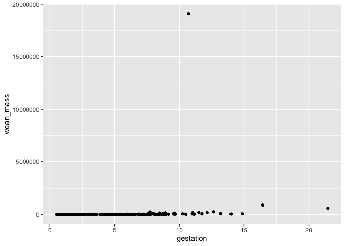<!-- -->


```r
life_history %>% 
  select(gestation, wean_mass) %>% 
  ggplot(aes(x=gestation, y=wean_mass))+
  geom_point(na.rm = T)+
  scale_y_log10()
```

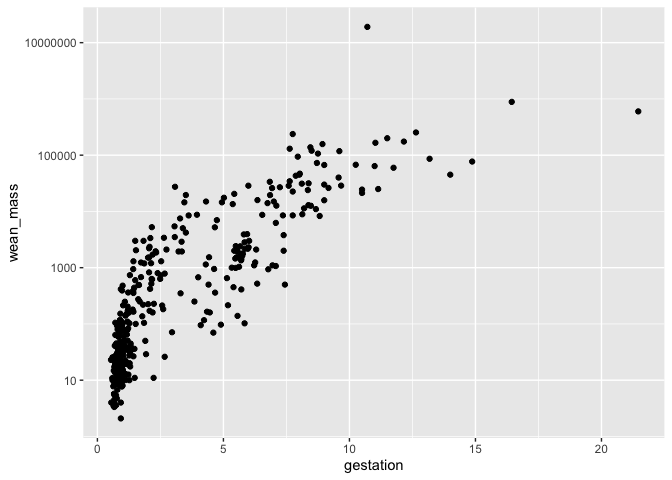<!-- -->

**Examples**
What is the relationship between log10.hra and log10.preymass? What do you notice about how ggplot treats NA's?

```r
ggplot(data=homerange,
       mapping = aes(x=log10.hra, y=log10.preymass))+
  geom_point(na.rm=T)+
  geom_smooth(method=lm, se=T, na.rm = T)
```

```
## `geom_smooth()` using formula = 'y ~ x'
```

<!-- -->

### Bar Plot: geom_bar
The simplest type of bar plot counts the number of observations in a categorical variable. In this case, we want to know how many observations are present in the variable `trophic.guild`. Notice that we do not specify a y-axis because it is count by default.  


```r
names(homerange)
```

```
##  [1] "taxon"                      "common.name"               
##  [3] "class"                      "order"                     
##  [5] "family"                     "genus"                     
##  [7] "species"                    "primarymethod"             
##  [9] "N"                          "mean.mass.g"               
## [11] "log10.mass"                 "alternative.mass.reference"
## [13] "mean.hra.m2"                "log10.hra"                 
## [15] "hra.reference"              "realm"                     
## [17] "thermoregulation"           "locomotion"                
## [19] "trophic.guild"              "dimension"                 
## [21] "preymass"                   "log10.preymass"            
## [23] "PPMR"                       "prey.size.reference"
```


```r
homerange %>% 
  count(trophic.guild)
```

```
## # A tibble: 2 × 2
##   trophic.guild     n
##   <chr>         <int>
## 1 carnivore       342
## 2 herbivore       227
```

Also notice that we can use pipes! The `mapping=` function is implied by `aes` and so is often left out. 

```r
homerange %>% 
  ggplot(aes(trophic.guild)) +  #don't need to use x since we are counting one variable
  geom_bar() #good for counts and categorical data not continuous 
```

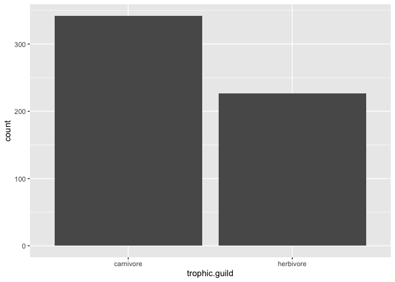<!-- -->


```r
life_history <- read_csv("data/mammal_lifehistories_v2.csv", na="-999") %>% clean_names()
```


```r
life_history %>% 
  ggplot(aes(x=order))+ #counting observations in a catagorical variable 
  geom_bar()+
  coord_flip()
```

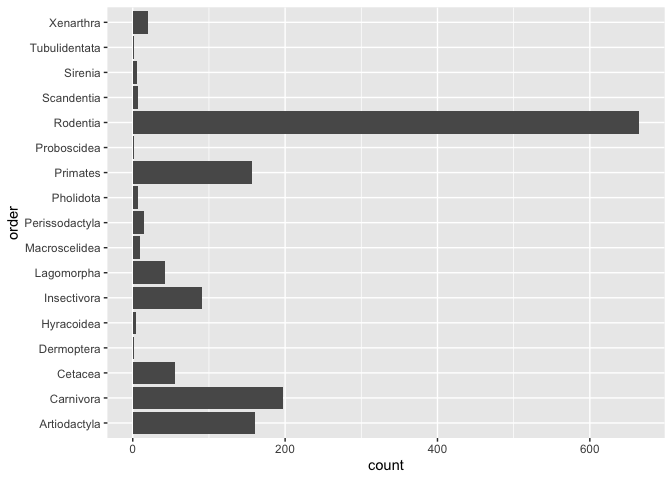<!-- -->

### Bar Plot: geom_col
Unlike `geom_bar()`, `geom_col()` allows us to specify an x-axis and a y-axis.

```r
homerange %>% 
  filter(family=="salmonidae") %>%
  select(common.name, log10.mass) %>% 
  ggplot(aes(y=common.name, x=log10.mass))+ #notice the switch in x and y => specified the y first
  geom_col()
```

<!-- -->

`geom_bar()` with `stat="identity"`
`stat="identity"` allows us to map a variable to the y-axis so that we aren't restricted to counts.

```r
homerange %>% 
  filter(family=="salmonidae") %>% 
  ggplot(aes(x=common.name, y=log10.mass))+
  geom_bar(stat="identity") #only use when you want a count
```

<!-- -->


```r
life_history <- read_csv("data/mammal_lifehistories_v2.csv", na="-999") %>% clean_names()
```


```r
life_history %>% 
  count(order, sort = T) %>% #sort = T is the same as arrange 
  ggplot(aes(x=order, y=n))+
  geom_col()+ #specify an x and y
  coord_flip()
```

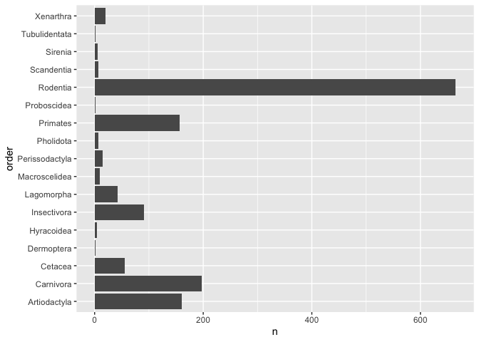<!-- -->


```r
life_history %>% 
  group_by(order) %>% 
  summarise(mean_mass=mean(mass, na.rm = T)) %>% 
  ggplot(aes(x=order, y=mean_mass))+
  geom_col()+
  coord_flip()
```

<!-- -->

There are a few problems here. First, the y-axis is in scientific notation. We can fix this by adjusting the options for the session.

```r
options(scipen=999) #cancels scientific notation for the session
```

Next, the y-axis is not on a log scale. We can fix this by adding `scale_y_log10()`.

```r
life_history %>% 
  group_by(order) %>% 
  summarise(mean_mass=mean(mass, na.rm = T)) %>% 
  ggplot(aes(x=order, y=mean_mass))+
  geom_col()+
  coord_flip()+
  scale_y_log10()
```

<!-- -->

Lastly, we can adjust the x-axis labels to make them more readable. We do this using `reorder`.

```r
life_history %>% 
  group_by(order) %>% 
  summarise(mean_mass=mean(mass, na.rm = T)) %>% 
  ggplot(aes(x=reorder(order, mean_mass), y=mean_mass))+ #this orders x axis by mean mass
  geom_col()+
  coord_flip()+
  scale_y_log10()
```

<!-- -->

**Examples**
Filter the `homerange` data to include `mammals` only.

```r
homerange %>% 
  filter(class=="mammalia")
```

```
## # A tibble: 238 × 24
##    taxon   common.name      class order family genus species primarymethod N    
##    <chr>   <chr>            <chr> <chr> <chr>  <chr> <chr>   <chr>         <chr>
##  1 mammals giant golden mo… mamm… afro… chrys… chry… trevel… telemetry*    <NA> 
##  2 mammals Grant's golden … mamm… afro… chrys… erem… granti  telemetry*    <NA> 
##  3 mammals pronghorn        mamm… arti… antil… anti… americ… telemetry*    <NA> 
##  4 mammals impala           mamm… arti… bovid… aepy… melamp… telemetry*    <NA> 
##  5 mammals hartebeest       mamm… arti… bovid… alce… busela… telemetry*    <NA> 
##  6 mammals barbary sheep    mamm… arti… bovid… ammo… lervia  telemetry*    <NA> 
##  7 mammals American bison   mamm… arti… bovid… bison bison   telemetry*    <NA> 
##  8 mammals European bison   mamm… arti… bovid… bison bonasus telemetry*    <NA> 
##  9 mammals goat             mamm… arti… bovid… capra hircus  telemetry*    <NA> 
## 10 mammals Spanish ibex     mamm… arti… bovid… capra pyrena… telemetry*    <NA> 
## # ℹ 228 more rows
## # ℹ 15 more variables: mean.mass.g <dbl>, log10.mass <dbl>,
## #   alternative.mass.reference <chr>, mean.hra.m2 <dbl>, log10.hra <dbl>,
## #   hra.reference <chr>, realm <chr>, thermoregulation <chr>, locomotion <chr>,
## #   trophic.guild <chr>, dimension <dbl>, preymass <dbl>, log10.preymass <dbl>,
## #   PPMR <dbl>, prey.size.reference <chr>
```

Are there more herbivores or carnivores in mammals? Make a bar plot that shows their relative numbers.

```r
homerange %>% 
  select(class, trophic.guild) %>% 
  filter(class=="mammalia") %>% 
  ggplot(aes(trophic.guild))+
  geom_bar()
```

<!-- -->

Make a bar plot that shows the masses of the top 10 smallest mammals.

```r
homerange %>% 
  filter(class=="mammalia") %>% 
  top_n(-10, log10.mass) %>% 
  ggplot(aes(x=common.name, y=log10.mass))+
  geom_col()+ #use when you have x and y axis
  coord_flip()
```

<!-- -->

**Examples**

```r
penguins
```

```
## # A tibble: 344 × 8
##    species island    bill_length_mm bill_depth_mm flipper_length_mm body_mass_g
##    <fct>   <fct>              <dbl>         <dbl>             <int>       <int>
##  1 Adelie  Torgersen           39.1          18.7               181        3750
##  2 Adelie  Torgersen           39.5          17.4               186        3800
##  3 Adelie  Torgersen           40.3          18                 195        3250
##  4 Adelie  Torgersen           NA            NA                  NA          NA
##  5 Adelie  Torgersen           36.7          19.3               193        3450
##  6 Adelie  Torgersen           39.3          20.6               190        3650
##  7 Adelie  Torgersen           38.9          17.8               181        3625
##  8 Adelie  Torgersen           39.2          19.6               195        4675
##  9 Adelie  Torgersen           34.1          18.1               193        3475
## 10 Adelie  Torgersen           42            20.2               190        4250
## # ℹ 334 more rows
## # ℹ 2 more variables: sex <fct>, year <int>
```

In a previous lab, we asked how many penguins were measured on each island.

```r
penguins %>% 
  count(island)
```

```
## # A tibble: 3 × 2
##   island        n
##   <fct>     <int>
## 1 Biscoe      168
## 2 Dream       124
## 3 Torgersen    52
```

Make this output more visual by adding a plot...

```r
penguins %>% 
  count(island) %>% 
  ggplot(aes(x=island, y=n))+
  geom_col()
```

<!-- -->


```r
names(penguins)
```

```
## [1] "species"           "island"            "bill_length_mm"   
## [4] "bill_depth_mm"     "flipper_length_mm" "body_mass_g"      
## [7] "sex"               "year"
```

What if we wanted a plot that showed the number of measured penguins for each species?

```r
penguins %>% 
  count(species) %>% 
  ggplot(aes(x=species, y=n))+
  geom_col()
```

<!-- -->


```r
penguins %>% 
  ggplot(aes(species))+
  geom_bar()
```

<!-- -->

How about average bill length by sex?

```r
penguins %>% 
  filter(sex!="NA") %>% 
  group_by(sex) %>% 
  summarise(avg_bill_lenth_mm=mean(bill_length_mm)) %>% 
  ggplot(aes(x=sex, y=avg_bill_lenth_mm))+
  geom_col()
```

<!-- -->

### Box Plots
For the next series of examples, we will use the `homerange` data.  


```r
homerange <- read_csv("data/Tamburelloetal_HomeRangeDatabase.csv")
```

Boxplots help us visualize a range of values. So, on the x-axis we typically have something categorical and the y-axis is the range. In the case below, we are plotting `log10.mass` by taxonomic class in the `homerange` data. `geom_boxplot()` is the geom type for a standard box plot. The center line in each box represents the median, not the mean.

Let's look at the variable `log10.mass` grouped by taxonomic class.

```r
homerange %>% 
  group_by(class) %>% 
  summarize(min_log10.mass=min(log10.mass),
            max_log10.mass=max(log10.mass),
            median_log10.mass=median(log10.mass))
```

```
## # A tibble: 4 × 4
##   class          min_log10.mass max_log10.mass median_log10.mass
##   <chr>                   <dbl>          <dbl>             <dbl>
## 1 actinopterygii         -0.658           3.55              2.08
## 2 aves                    0.712           4.95              1.82
## 3 mammalia                0.620           6.60              3.33
## 4 reptilia                0.539           4.03              2.51
```


```r
homerange %>% 
  ggplot(aes(x = class, y = log10.mass)) +
  geom_boxplot()
```

<!-- -->

**Examples**
There are more herbivores than carnivores in the homerange data, but how do their masses compare? Make a summary and boxplot that compares their masses. Use `log10.mass`.

```r
homerange %>% 
  select(trophic.guild, log10.mass) %>% 
  ggplot(aes(x=trophic.guild, y=log10.mass))+
  geom_boxplot()
```

<!-- -->

Now use a boxplot to visualize the range of log10.mass by family of mammalian carnivore.

```r
homerange %>% 
  filter(trophic.guild=="carnivore" & class=="mammalia") %>% 
  ggplot(aes(x=family, y=log10.mass))+
  geom_boxplot()+
  coord_flip()
```

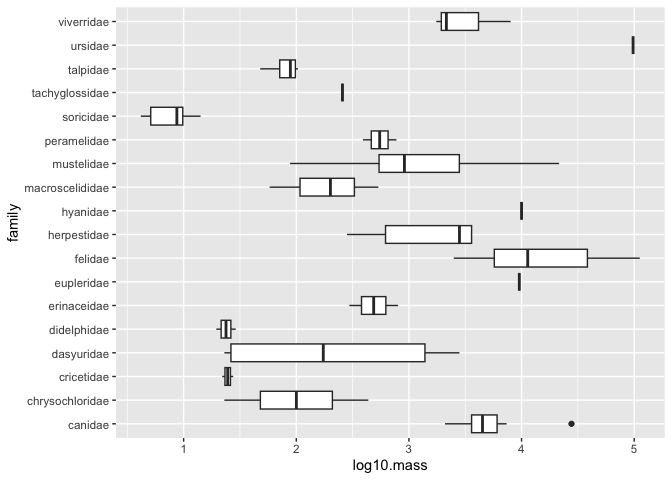<!-- -->


```r
life_history %>% 
  ggplot(aes(x=order, y=mass))+
  geom_boxplot(na.rm = T)+
  coord_flip()+
  scale_y_log10()
```

<!-- -->

## LAB 11

### Aesthetics: Labels

```r
elephants <- read_csv("data/elephantsMF.csv") %>% clean_names()
```

```
## Rows: 288 Columns: 3
## ── Column specification ────────────────────────────────────────────────────────
## Delimiter: ","
## chr (1): Sex
## dbl (2): Age, Height
## 
## ℹ Use `spec()` to retrieve the full column specification for this data.
## ℹ Specify the column types or set `show_col_types = FALSE` to quiet this message.
```

Make a plot that compares age and height of elephants.

```r
elephants %>% 
  ggplot(aes(x=age, y=height))+
  geom_point()+ #compares two continuous variables 
  geom_smooth(method = lm, se=F)
```

```
## `geom_smooth()` using formula = 'y ~ x'
```

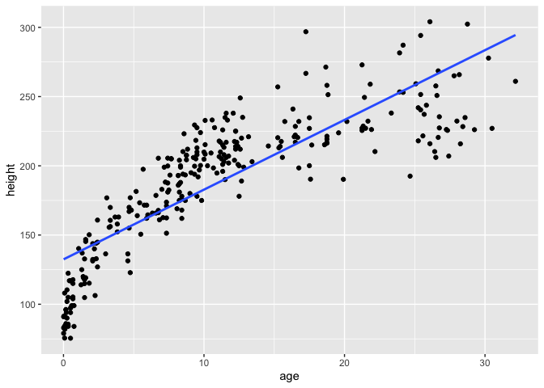<!-- -->

The plot looks clean, but it is incomplete. A reader unfamiliar with the data might have a difficult time interpreting the labels. To add custom labels, we use the `labs` command.

```r
elephants %>% 
  ggplot(aes(x=age, y=height)) + 
  geom_point() + 
  geom_smooth(method=lm, se=F)+
  labs(title="Elephant Age vs. Height", #adds a title
       x="Age (years)", #adds names on axis
       y="Height (cm)")
```

```
## `geom_smooth()` using formula = 'y ~ x'
```

<!-- -->

We can improve the plot further by adjusting the size and face of the text. We do this using `theme()`. The `rel()` option changes the relative size of the title to keep things consistent. Adding `hjust` allows control of title position.

```r
elephants %>% 
  ggplot(aes(x=age, y=height)) + 
  geom_point() + 
  geom_smooth(method=lm, se=F)+
  labs(title="Elephant Age vs. Height", #adds a title
       x="Age (years)", #adds names on axis
       y="Height (cm)")+
  theme(plot.title = element_text(size=rel(1.5), hjust=0.5)) #size changes the size of the title, hjust changes the location of the title, 0=left, 0.5=middle, 1=right
```

```
## `geom_smooth()` using formula = 'y ~ x'
```

<!-- -->

### Other Aesthetics
There are lots of options for aesthetics. An aesthetic can be assigned to either numeric or categorical data. `fill` is a common grouping option; notice that an appropriate key is displayed when you use one of these options.

```r
elephants %>% 
  ggplot(aes(x=sex, fill=sex))+ #fill is a grouping option, color in bar by sex
  geom_bar()
```

<!-- -->

`size` adjusts the size of points relative to a continuous variable.

```r
life_history %>% 
  ggplot(aes(x=gestation, y=log10(mass), size=mass))+ #can adjust the size of point relative to the mass
  geom_point(na.rm=T)
```

<!-- -->


```r
homerange <- 
  read_csv("data/Tamburelloetal_HomeRangeDatabase.csv", na = c("", "NA", "\\"))
```

```
## Rows: 569 Columns: 24
## ── Column specification ────────────────────────────────────────────────────────
## Delimiter: ","
## chr (16): taxon, common.name, class, order, family, genus, species, primarym...
## dbl  (8): mean.mass.g, log10.mass, mean.hra.m2, log10.hra, dimension, preyma...
## 
## ℹ Use `spec()` to retrieve the full column specification for this data.
## ℹ Specify the column types or set `show_col_types = FALSE` to quiet this message.
```

There are many options to create nice plots in ggplot. One useful trick is to store the plot as a new object and then experiment with geom's and aesthetics. Let's setup a plot that compares `log10.mass` and `log10.hra.` Notice that we are not specifying a geom.

```r
p <- homerange %>% 
  ggplot(aes(x= log10.mass, y= log10.hra))
```

Play with point size by adjusting the `size` argument.

```r
p + geom_point(size=0.25) #adjust the size of the dots
```

<!-- -->

We can color the points by a categorical variable.

```r
p + geom_point(aes(color=thermoregulation), size=1.00) #for scatter plots, color is the same as fill in bar plots
```

<!-- -->

We can also map shapes to another categorical variable.

```r
p + geom_point(aes(color=thermoregulation, shape=thermoregulation), size=2.00)
```

<!-- -->

### Barplots and multiple variables
At this point you should be comfortable building bar plots that show counts of observations using `geom_bar()`. Last time we explored the `fill` option as a way to bring color to the plot; i.e. we filled by the same variable that we were plotting. What happens when we fill by a different categorical variable?  
Let's start by counting how many observations we have in each taxonomic group.

```r
homerange %>% count(taxon, sort=T)
```

```
## # A tibble: 9 × 2
##   taxon             n
##   <chr>         <int>
## 1 mammals         238
## 2 birds           140
## 3 marine fishes    90
## 4 snakes           41
## 5 river fishes     14
## 6 turtles          14
## 7 tortoises        12
## 8 lizards          11
## 9 lake fishes       9
```

Now let's make a bar plot of these data.

```r
homerange %>% 
  count(taxon, sort=T) %>% 
  ggplot(aes(x=taxon, y=n))+
  geom_col()+
  coord_flip()+
  labs(title = "Observation by Taxon",
       x="Taxonomic group")
```

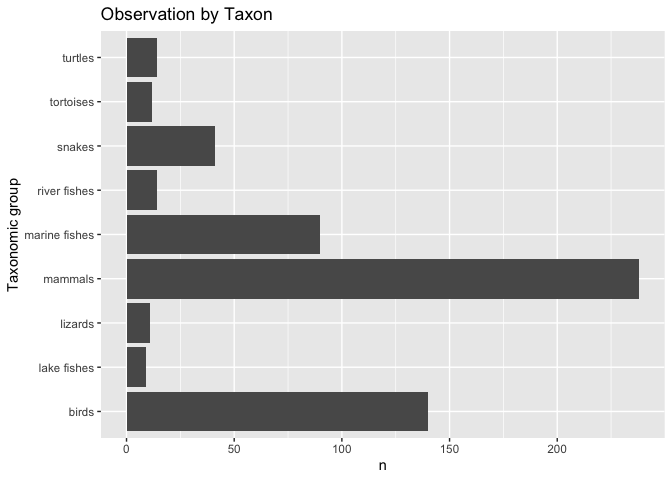<!-- -->

By specifying `fill=trophic.guild` we build a stacked bar plot that shows the proportion of a given taxonomic group that is an herbivore or carnivore.

```r
homerange %>% 
  ggplot(aes(x=taxon, fill=trophic.guild))+
  geom_bar()+
  coord_flip()+
  labs(title = "Observation by Taxon",
       x="Taxonomic group")
```

<!-- -->


```r
homerange %>% 
  ggplot(aes(x=taxon, fill=taxon))+
  geom_bar()+
  coord_flip()+
  labs(title = "Observation by Taxon",
       x="Taxonomic group")
```

<!-- -->

We can also have counts of each trophic guild within taxonomic group shown side-by-side by specifying `position="dodge"`.

```r
homerange %>% 
  ggplot(aes(x=taxon, fill=trophic.guild))+
  geom_bar(position = "dodge")+
  coord_flip()+
  labs(title = "Observation by Taxon",
       x="Taxonomic group")
```

<!-- -->

Here is the same plot oriented vertically.

```r
homerange %>% 
  ggplot(aes(x=taxon, fill=trophic.guild))+
  geom_bar(position = "dodge")+
  theme(axis.text.x=element_text(angle=45, hjust = 1))+
  labs(title = "Observation by Taxon",
       x="Taxonomic group")
```

<!-- -->

We can also scale all bars to a percentage.

```r
homerange %>% 
  ggplot(aes(x = taxon, fill = trophic.guild))+
  geom_bar(position = position_fill())+ 
  scale_y_continuous(labels = scales::percent)+
  coord_flip()
```

<!-- -->

**Examples**
Make a bar plot that shows counts of individuals by island. Fill by species, and try both a stacked bar plot and `position="dodge"`.

```r
penguins %>% 
  ggplot(aes(x=island, fill=species))+
  geom_bar()+
  labs(title = "Count of Individuals per Island",
       x="Species",
       y="Count")
```

<!-- -->


```r
penguins %>% 
  ggplot(aes(x=island, fill=species))+
  geom_bar(position = "dodge")+
  labs(title = "Count of Individuals per Island",
       x="Species",
       y="Count")
```

<!-- -->


```r
penguins %>% 
  count(species)
```

```
## # A tibble: 3 × 2
##   species       n
##   <fct>     <int>
## 1 Adelie      152
## 2 Chinstrap    68
## 3 Gentoo      124
```


```r
penguins %>% 
  count(species) %>% 
  ggplot(aes(x=species, y=n))+
  geom_col()+
  labs(title = "Number of Species per Island",
       x="Species",
       y="Count")
```

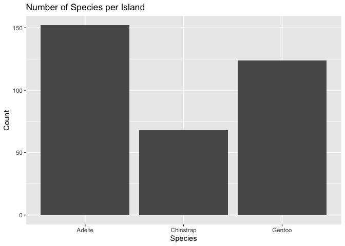<!-- -->


```r
penguins %>% 
  ggplot(aes(x=species, fill=species))+
  geom_bar(position = "dodge")+
  theme(axis.text.x=element_text(angle=45, hjust = 1))+
  labs(title = "Number of Species per Island",
       x="Species",
       y="Count")
```

<!-- -->


```r
penguins %>% 
  ggplot(aes(x=species, fill=species))+
  geom_bar(position = position_fill())+
  theme(axis.text.x=element_text(angle=45, hjust = 1))+
  labs(title = "Number of Species per Island",
       x="Species",
       y="Count")
```

<!-- -->


```r
penguins
```

```
## # A tibble: 344 × 8
##    species island    bill_length_mm bill_depth_mm flipper_length_mm body_mass_g
##    <fct>   <fct>              <dbl>         <dbl>             <int>       <int>
##  1 Adelie  Torgersen           39.1          18.7               181        3750
##  2 Adelie  Torgersen           39.5          17.4               186        3800
##  3 Adelie  Torgersen           40.3          18                 195        3250
##  4 Adelie  Torgersen           NA            NA                  NA          NA
##  5 Adelie  Torgersen           36.7          19.3               193        3450
##  6 Adelie  Torgersen           39.3          20.6               190        3650
##  7 Adelie  Torgersen           38.9          17.8               181        3625
##  8 Adelie  Torgersen           39.2          19.6               195        4675
##  9 Adelie  Torgersen           34.1          18.1               193        3475
## 10 Adelie  Torgersen           42            20.2               190        4250
## # ℹ 334 more rows
## # ℹ 2 more variables: sex <fct>, year <int>
```

Make another bar plot that shows the number of individuals by sex on each island?

```r
penguins %>% 
  count(sex)
```

```
## # A tibble: 3 × 2
##   sex        n
##   <fct>  <int>
## 1 female   165
## 2 male     168
## 3 <NA>      11
```


```r
penguins %>% 
  filter(sex!="NA") %>% 
  ggplot(aes(x=island, fill=sex))+
  geom_bar(position = "dodge")+
  labs(title = "Number of Males and Females per Island",
       x="Sex",
       y="Count")
```

<!-- -->

### group
In addition to `fill`, `group` is an aesthetic that accomplishes the same function but does not add color.

Here is a box plot that shows `log10.mass` by taxonomic `class.`

```r
homerange %>% 
  ggplot(aes(x = class, y = log10.mass)) +
  geom_boxplot() #use for range
```

<!-- -->

I use `group` to make individual box plots for each taxon within class.

```r
homerange %>% 
  ggplot(aes(x = class, y = log10.mass, group = taxon)) + #group makes individual box plots
  geom_boxplot()
```

<!-- -->

I can also use `fill` to associate the different taxa with a color coded key.

```r
homerange %>% 
  ggplot(aes(x = class, y = log10.mass, fill = taxon)) +
  geom_boxplot(alpha=0.5) #adds transparency 
```

<!-- -->


## LAB 12


```r
deserts <- read_csv("data/surveys_complete.csv")
```


```r
homerange <- read_csv("data/Tamburelloetal_HomeRangeDatabase.csv", na = c("", "NA", "\\"))
```

### Line plots **ON MIDTERM 2**
Line plots are great when you need to show changes over time. Here we look at the number of samples for species DM and DS over the years represented in the `deserts` data. This takes some careful thought- we want to know how sampling has changed over time for these two species.    

Let's start by making a clear x and y so we know what we are going to plot.

```r
deserts %>% 
  filter(species_id=="DM" | species_id=="DS") %>% 
  mutate(year=as.factor(year)) %>% #change to factor because this represents data points
  group_by(year, species_id) %>% 
  summarise(n=n(), .groups = "keep") %>% 
  pivot_wider(names_from = species_id, values_from = n)
```

```
## # A tibble: 26 × 3
## # Groups:   year [26]
##    year     DM    DS
##    <fct> <int> <int>
##  1 1977    264    98
##  2 1978    389   320
##  3 1979    209   204
##  4 1980    493   346
##  5 1981    559   354
##  6 1982    609   354
##  7 1983    528   280
##  8 1984    396    76
##  9 1985    667    98
## 10 1986    406    88
## # ℹ 16 more rows
```


```r
deserts %>% 
  filter(species_id=="DM" | species_id=="DS") %>% 
  mutate(year=as.factor(year)) %>% #change to factor because this represents data points
  group_by(year, species_id) %>% 
  summarise(n=n(), .groups = "keep") %>% 
  ggplot(aes(x=year, y=n, group=species_id, color=species_id))+
  geom_line()+
  geom_point(shape=10)+ #can experiement with shapes
  theme(axis.text.x = element_text(angle=60, hjust=1))+
  labs(title="Number of Samples for Species DM and DS",
       x="Year",
       y="n")
```

<!-- -->

### Histograms
Histograms are frequently used by biologists; they show the distribution of continuous variables. As students, you have seen histograms of grade distributions. A histogram `bins` the data and you specify the number of bins that encompass a range of observations. For something like grades, this is easy because the number of bins corresponds to the grades A-F. By default, R uses a formula to calculate the number of bins but some adjustment may be required.  

What does the distribution of body mass look like in the `homerange` data?

```r
homerange %>% 
  ggplot(aes(x = log10.mass)) +
  geom_histogram(bins = 20)+ #we can adjust the number of bins with the bins argument
  labs(title = "Distribution of Body Mass")
```

<!-- -->

Let's play with the colors. This shows all 657 of R's built-in colors. Notice that `color` and `fill` do different things!

```r
#grDevices::colors()
```

Let's rebuild the histogram, but this time we will specify the color and fill. Do a little experimentation on your own with the different colors.

```r
homerange %>% 
  ggplot(aes(x = log10.mass)) +
  geom_histogram(color = "black", fill = "papayawhip", bins=10)+
  labs(title = "Distribution of Body Mass")
```

<!-- -->

### Density plots  
Density plots are similar to histograms but they use a smoothing function to make the distribution more even and clean looking. They do not use bins.

```r
homerange %>% 
  ggplot(aes(x = log10.mass)) +
  geom_density(fill="deepskyblue4", alpha  =0.4, color = "black")+ #alpha is the transparency, show continuous variables 
  labs(title = "Distribution of Body Mass")
```

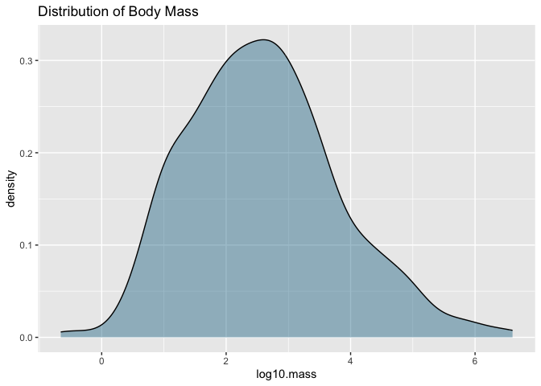<!-- -->

I like to see both the histogram and the density curve so I often plot them together. Note that I assign the density plot a different color.

```r
homerange %>% 
  ggplot(aes(x=log10.mass)) +
  geom_histogram(aes(y = after_stat(density)), fill = "deepskyblue4", alpha = 0.4, color = "black")+
  geom_density(color = "red")+
  labs(title = "Distribution of Body Mass")
```

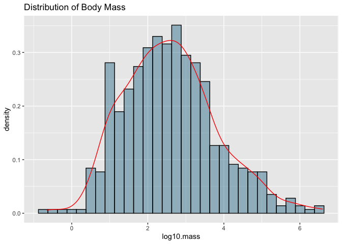<!-- -->

**Examples**
1. Make a histogram of `log10.hra`. Make sure to add a title.

```r
homerange %>% 
  ggplot(aes(x=log10.hra)) + #only need to specify x
  geom_histogram(color = "black", fill = "salmon")+
  labs(title = "Histogram of Homerange")
```

```
## `stat_bin()` using `bins = 30`. Pick better value with `binwidth`.
```

<!-- -->

2. Now plot the same variable using `geom_density()`.

```r
homerange %>% 
  ggplot(aes(x=log10.hra)) +
  geom_density(fill = "salmon", alpha=0.6, color = "black")+
  labs(title = "Histogram of Homerange")
```

<!-- -->

3. Combine them both!

```r
homerange %>% 
  ggplot(aes(x=log10.hra))+
  geom_histogram(aes(y=after_stat(density)), fill="violetred4", alpha=0.3, color="black")+
  geom_density(color="salmon")+
  labs(title = "Histogram of Homerange")
```

```
## `stat_bin()` using `bins = 30`. Pick better value with `binwidth`.
```

<!-- -->

### Create Categories with mutate and case_when() **ON MIDTERM 2**
`case_when()` is a very handy function from `dplyr` which allows us to calculate a new variable from other variables. We use `case_when()` within `mutate()` to do this.`case_when()` allows us to specify multiple conditions. Let's reclassify the body mass variable into a new factor variable with small, medium, and large animals. In this case, we are making a continuous variable into a categorical variable.  

```r
glimpse(homerange)
```

```
## Rows: 569
## Columns: 24
## $ taxon                      <chr> "lake fishes", "river fishes", "river fishe…
## $ common.name                <chr> "american eel", "blacktail redhorse", "cent…
## $ class                      <chr> "actinopterygii", "actinopterygii", "actino…
## $ order                      <chr> "anguilliformes", "cypriniformes", "cyprini…
## $ family                     <chr> "anguillidae", "catostomidae", "cyprinidae"…
## $ genus                      <chr> "anguilla", "moxostoma", "campostoma", "cli…
## $ species                    <chr> "rostrata", "poecilura", "anomalum", "fundu…
## $ primarymethod              <chr> "telemetry", "mark-recapture", "mark-recapt…
## $ N                          <chr> "16", NA, "20", "26", "17", "5", "2", "2", …
## $ mean.mass.g                <dbl> 887.00, 562.00, 34.00, 4.00, 4.00, 3525.00,…
## $ log10.mass                 <dbl> 2.9479236, 2.7497363, 1.5314789, 0.6020600,…
## $ alternative.mass.reference <chr> NA, NA, NA, NA, NA, NA, NA, NA, NA, NA, NA,…
## $ mean.hra.m2                <dbl> 282750.00, 282.10, 116.11, 125.50, 87.10, 3…
## $ log10.hra                  <dbl> 5.4514026, 2.4504031, 2.0648696, 2.0986437,…
## $ hra.reference              <chr> "Minns, C. K. 1995. Allometry of home range…
## $ realm                      <chr> "aquatic", "aquatic", "aquatic", "aquatic",…
## $ thermoregulation           <chr> "ectotherm", "ectotherm", "ectotherm", "ect…
## $ locomotion                 <chr> "swimming", "swimming", "swimming", "swimmi…
## $ trophic.guild              <chr> "carnivore", "carnivore", "carnivore", "car…
## $ dimension                  <dbl> 3, 2, 2, 2, 2, 2, 2, 2, 2, 2, 2, 2, 2, 3, 3…
## $ preymass                   <dbl> NA, NA, NA, NA, NA, NA, 1.39, NA, NA, NA, N…
## $ log10.preymass             <dbl> NA, NA, NA, NA, NA, NA, 0.1430148, NA, NA, …
## $ PPMR                       <dbl> NA, NA, NA, NA, NA, NA, 530, NA, NA, NA, NA…
## $ prey.size.reference        <chr> NA, NA, NA, NA, NA, NA, "Brose U, et al. 20…
```


```r
homerange %>% 
  select(log10.mass) %>% 
  summarize(min=min(log10.mass),
            max=max(log10.mass))
```

```
## # A tibble: 1 × 2
##      min   max
##    <dbl> <dbl>
## 1 -0.658  6.60
```


```r
summary(homerange$log10.mass)
```

```
##    Min. 1st Qu.  Median    Mean 3rd Qu.    Max. 
## -0.6576  1.6990  2.5185  2.5947  3.3324  6.6021
```


```r
homerange %>% #ON MIDTERM 2
  mutate(mass_category=case_when(log10.mass<=1.75 ~ "small",
                                 log10.mass>1.75 & log10.mass<=2.75 ~ "medium",
                                 log10.mass>2.75 ~ "large")) %>% 
  select(mass_category)
```

```
## # A tibble: 569 × 1
##    mass_category
##    <chr>        
##  1 large        
##  2 medium       
##  3 small        
##  4 small        
##  5 small        
##  6 large        
##  7 large        
##  8 medium       
##  9 medium       
## 10 large        
## # ℹ 559 more rows
```

Here we check how the newly created body mass categories compare across `trophic.guild`. 

```r
homerange %>% #ON MIDTERM 2
  mutate(mass_category=case_when(log10.mass<=1.75 ~ "small",
                                 log10.mass>1.75 & log10.mass<=2.75 ~ "medium",
                                 log10.mass>2.75 ~ "large")) %>% 
  ggplot(aes(x=mass_category, fill=trophic.guild))+
  geom_bar(position = "dodge")
```

<!-- -->

**Examples**
1. Use case_when() to make a new column `range_category` that breaks down `log10.hra` into very small, small, medium, and large classes based on quartile.

```r
library(gtools)
#install.packages("gtools")
```


```r
summary(homerange$log10.mass)
```

```
##    Min. 1st Qu.  Median    Mean 3rd Qu.    Max. 
## -0.6576  1.6990  2.5185  2.5947  3.3324  6.6021
```


```r
quartiles <- quantcut(homerange$log10.hra)
table(quartiles)
```

```
## quartiles
## [-1.52,3.65]  (3.65,4.59]  (4.59,6.02]  (6.02,9.55] 
##          143          142          142          142
```


```r
homerange %>% 
  mutate(range_category=case_when(log10.hra<3.65 ~"very small",
                                  log10.hra>=3.65 & log10.hra<=4.59 ~ "small",
                                  log10.hra>4.59 & log10.hra<=6.02 ~ "medium",
                                  log10.hra>=6.02 ~ "large"))
```

```
## # A tibble: 569 × 25
##    taxon        common.name class order family genus species primarymethod N    
##    <chr>        <chr>       <chr> <chr> <chr>  <chr> <chr>   <chr>         <chr>
##  1 lake fishes  american e… acti… angu… angui… angu… rostra… telemetry     16   
##  2 river fishes blacktail … acti… cypr… catos… moxo… poecil… mark-recaptu… <NA> 
##  3 river fishes central st… acti… cypr… cypri… camp… anomal… mark-recaptu… 20   
##  4 river fishes rosyside d… acti… cypr… cypri… clin… fundul… mark-recaptu… 26   
##  5 river fishes longnose d… acti… cypr… cypri… rhin… catara… mark-recaptu… 17   
##  6 river fishes muskellunge acti… esoc… esoci… esox  masqui… telemetry     5    
##  7 marine fish… pollack     acti… gadi… gadid… poll… pollac… telemetry     2    
##  8 marine fish… saithe      acti… gadi… gadid… poll… virens  telemetry     2    
##  9 marine fish… lined surg… acti… perc… acant… acan… lineat… direct obser… <NA> 
## 10 marine fish… orangespin… acti… perc… acant… naso  litura… telemetry     8    
## # ℹ 559 more rows
## # ℹ 16 more variables: mean.mass.g <dbl>, log10.mass <dbl>,
## #   alternative.mass.reference <chr>, mean.hra.m2 <dbl>, log10.hra <dbl>,
## #   hra.reference <chr>, realm <chr>, thermoregulation <chr>, locomotion <chr>,
## #   trophic.guild <chr>, dimension <dbl>, preymass <dbl>, log10.preymass <dbl>,
## #   PPMR <dbl>, prey.size.reference <chr>, range_category <chr>
```

2. Make a plot that shows how many and which taxonomic classes are represented in each `range_category`.   

```r
homerange %>% 
  mutate(range_category=case_when(log10.hra<3.65 ~"very small",
                                  log10.hra>=3.65 & log10.hra<=4.59 ~ "small",
                                  log10.hra>4.59 & log10.hra<=6.02 ~ "medium",
                                  log10.hra>=6.02 ~ "large")) %>% 
  ggplot(aes(x=range_category, fill=class))+
  geom_bar(position = "dodge", alpha=0.6, color="black")
```

<!-- -->

3. Isolate the small `range_category` and plot the range of `log10.mass` by taxonomic class.

```r
homerange %>% 
  mutate(range_category=case_when(log10.hra<3.65 ~"very small",
                                  log10.hra>=3.65 & log10.hra<=4.59 ~ "small",
                                  log10.hra>4.59 & log10.hra<=6.02 ~ "medium",
                                  log10.hra>=6.02 ~ "large")) %>% 
  filter(range_category=="small") %>% 
  ggplot(aes(x=class, y=log10.mass, fill=class))+
  geom_boxplot()
```

<!-- -->

### ggplot themes
There are many options to change the theme of your plots within ggplot. Have a look [here]https://ggplot2.tidyverse.org/reference/ggtheme.html) for a list of the themes.  

Let's start by building a simple barplot.  

```r
p <- homerange %>% 
  ggplot(aes(x=taxon, fill=trophic.guild))+
  geom_bar(na.rm=T, position="dodge")
p
```

<!-- -->

Have a look at the `linedraw` theme; I am adding it as another layer.

```r
p + theme_linedraw()+
  theme(axis.text.x = element_text(angle = 60, hjust=1))+
  labs(title = "Observations by Taxon in Homerange Data",
       x = NULL,
       y= "n",
       fill= "Trophic Guild")
```

<!-- -->

**Examples**
1. Build a scatterplot that compares `log10.mass` and `log10.preymass`. Color the points by `taxon`. Store this plot as object `q`.

```r
q <- homerange %>% 
  ggplot(aes(x=log10.mass, y=log10.preymass, color=taxon))+
  geom_point(na.rm = T)
q
```

<!-- -->

2. Use plot `q` but add the classic theme.

```r
q + theme_classic()
```

<!-- -->


```r
q + theme_minimal()
```

<!-- -->

### Legends
There are lots of options to manipulate legends. Have a look [here](http://www.sthda.com/english/wiki/ggplot2-legend-easy-steps-to-change-the-position-and-the-appearance-of-a-graph-legend-in-r-software).

```r
p+theme_linedraw()+
  theme(legend.position = "left", #moves the legend to differ location
        axis.text.x = element_text(angle = 60, hjust=1))+
  labs(title = "Observations by Taxon in Homerange Data",
       x = NULL, #removes label from x axis
       y= "n",
       fill= "Trophic Guild")
```

<!-- -->

### ggthemes
There are many packages that include additional themes, one of which is [ggthemes](https://yutannihilation.github.io/allYourFigureAreBelongToUs/). Some of these are nice because they are designed to mimic the look of popular publications.

```r
#install.packages("ggthemes")
library(ggthemes)
```

Here is a list of the `ggthemes`

```r
#ls("package:ggthemes")[grepl("theme_", ls("package:ggthemes"))]
```


```r
p + 
  theme_fivethirtyeight()+
  theme(legend.position = "bottom",
        axis.text.x = element_text(angle = 60, hjust=1))+
  labs(title = "Observations by Taxon in Homerange Data",
       x = NULL,
       y= "n",
       fill= "Trophic Guild")
```

<!-- -->

**Example**
1. Use plot `q` and try the `theme_economist()` theme.

```r
p + 
  theme_economist()+
  theme(legend.position = "bottom",
        axis.text.x = element_text(angle = 60, hjust=0))+
  labs(title = "Observations by Taxon in Homerange Data",
       x = NULL,
       y= "n",
       fill= "Trophic Guild")
```

<!-- -->

### RColorBrewer
The default colors used by ggplot are often uninspiring. They don't make plots pop out in presentations or publications, and you may want to use a customized palette to make things visually consistent.  

Access the help for `RColorBrewer`.

```r
?RColorBrewer #There are 3 types of palettes, sequential, diverging, and qualitative
```
1. Sequential palettes are suited to ordered data that progress from low to high. Lightness steps dominate the look of these schemes, with light colors for low data values to dark colors for high data values.
2. Diverging palettes put equal emphasis on mid-range critical values and extremes at both ends of the data range. The critical class or break in the middle of the legend is emphasized with light colors and low and high extremes are emphasized with dark colors that have contrasting hues.
3. Qualitative palettes do not imply magnitude differences between legend classes, and hues are used to create the primary visual differences between classes. Qualitative schemes are best suited to representing nominal or categorical data.
The thing to notice is that there are three different color palettes: 1) sequential, 2) diverging, and 3) qualitative. Within each of these there are several selections. You can bring up the colors by using `display.brewer.pal()`. Specify the number of colors that you want and the palette name.


```r
display.brewer.pal(9,"BuPu") #sequential palette
```

<!-- -->

The [R Color Brewer](http://colorbrewer2.org/#type=sequential&scheme=BuGn&n=3) website is very helpful for getting an idea of the color palettes. To make things easy, use these two guidelines:

+`scale_colour_brewer()` is for points  
+`scale_fill_brewer()` is for fills  

Here I chose the `Paired` palette. Take a moment and experiment with other options.

```r
p+scale_fill_brewer(palette = "Paired")+
  theme(legend.position = "bottom",
        axis.text.x = element_text(angle = 60, hjust=1))+
  labs(title = "Observations by Taxon in Homerange Data",
       x = NULL,
       y= "n",
       fill= "Trophic Guild")
```

<!-- -->

**Example**
1. Keep using the `same `q` plot, but test out one of R Color Brewer palettes.

```r
q + scale_colour_brewer(palette = "RdYlBu")+
  theme_solarized()+
  theme(legend.position = "left",
        axis.text.x = element_text(angle = 60, hjust=0))+
  labs(title = "Observations by Taxon in Homerange Data",
       x = NULL,
       y= "n",
       fill= "Trophic Guild")
```

<!-- -->

### Manually Setting Colors
You can also use `paleteer` to build a custom palette for consistency. To access the `paleteer` collection, I add it to a new object.

```r
colors <- paletteer::palettes_d_names
```


```r
colors
```

```
## # A tibble: 2,415 × 5
##    package   palette   length type        novelty
##    <chr>     <chr>      <int> <chr>       <lgl>  
##  1 awtools   a_palette      8 sequential  TRUE   
##  2 awtools   ppalette       8 qualitative TRUE   
##  3 awtools   bpalette      16 qualitative TRUE   
##  4 awtools   gpalette       4 sequential  TRUE   
##  5 awtools   mpalette       9 qualitative TRUE   
##  6 awtools   spalette       6 qualitative TRUE   
##  7 basetheme brutal        10 qualitative TRUE   
##  8 basetheme clean         10 qualitative TRUE   
##  9 basetheme dark          10 qualitative TRUE   
## 10 basetheme deepblue      10 qualitative TRUE   
## # ℹ 2,405 more rows
```

Now we can display the palettes. Assign the palette to `my_palette` and then build this base R bar plot. There are a lot of options; `paleteer` is a collection of popular palettes. I really like the [`ggsci` package] (https://cran.r-project.org/web/packages/ggsci/vignettes/ggsci.html)

```r
my_palette <- paletteer_d("vangogh::SunflowersMunich") 
```


```r
barplot(rep(1,6), axes=FALSE, col=my_palette)
```

<!-- -->

Now we just identify `my_palette` as part of `scale_fill_manual()`

```r
p+scale_fill_manual(values=my_palette)+
  theme(legend.position = "bottom",
        axis.text.x = element_text(angle = 60, hjust=1))+
  labs(title = "Observations by Taxon in Homerange Data",
       x = NULL,
       y= "n",
       fill= "Trophic Guild")
```

<!-- -->

**Example**
1. Keep using the `same `q` plot, but test out one of `paleteer` themes.

```r
my_palette2 <- paletteer_d("ggsci::springfield_simpsons") 
```


```r
barplot(rep(1,6), axes=FALSE, col=my_palette2)
```

<!-- -->


```r
q+theme_classic()+scale_colour_manual(values=my_palette2)+
  theme(legend.position = "bottom",
        axis.text.x = element_text(angle = 60, hjust=1))+
  labs(title = "Observations by Taxon in Homerange Data",
       x = NULL,
       y= "n",
       fill= "Trophic Guild")
```

<!-- -->

### Faceting
[Faceting](https://ggplot2-book.org/facet.html) is one of the amazing features of ggplot. It allows us to make multi-panel plots for easy comparison.  Here is a boxplot that shows the range of log10.mass by taxon.

```r
homerange %>% 
  ggplot(aes(x=taxon, y=log10.mass))+
  geom_boxplot()+
  facet_wrap(~trophic.guild)+
  theme(axis.text.x = element_text(angle = 60, hjust=1))
```

<!-- -->

There are other categorical variables that might be interesting to overlay. `facet_wrap()` makes a ribbon of panels by a specified categorical variable and allows you to control how you want them arranged.  

```r
homerange %>% 
  ggplot(aes(x=taxon, y=log10.mass))+
  geom_boxplot()+
  facet_wrap(~trophic.guild, ncol=2)+
  theme(axis.text.x = element_text(angle = 60, hjust=1))
```

<!-- -->

`facet_grid()` allows control over the faceted variable; it can be arranged in rows or columns. rows~columns. 

```r
homerange %>% 
  ggplot(aes(x=taxon, y=log10.mass))+
  geom_boxplot()+
  facet_grid(trophic.guild~.)+
  theme(axis.text.x = element_text(angle = 60, hjust=1))
```

<!-- -->

`facet_grid()` will also allow the comparison of two categorical variables, just remember a~b where a is rows and b is columns.  

```r
homerange %>% 
  ggplot(aes(x=taxon, y=log10.mass))+
  geom_boxplot()+
  facet_grid(trophic.guild~thermoregulation)+
  theme(axis.text.x = element_text(angle = 60, hjust=1))
```

<!-- -->

**Examples**
1. Use facet_wrap to compare the distribution of `log10.mass` by `thermoregulation`.

```r
homerange %>% 
  ggplot(aes(x=log10.mass))+
  geom_density(fill="steelblue", alpha=0.3)+
  facet_wrap(~thermoregulation)
```

<!-- -->

2. Use facet_grid to compare the distribution of `log10.mass` by `locomotion`.

```r
homerange %>% 
  ggplot(aes(x=log10.hra))+
  geom_density(fill="steelblue", alpha=0.3)+
  facet_grid(.~locomotion)
```

<!-- -->
